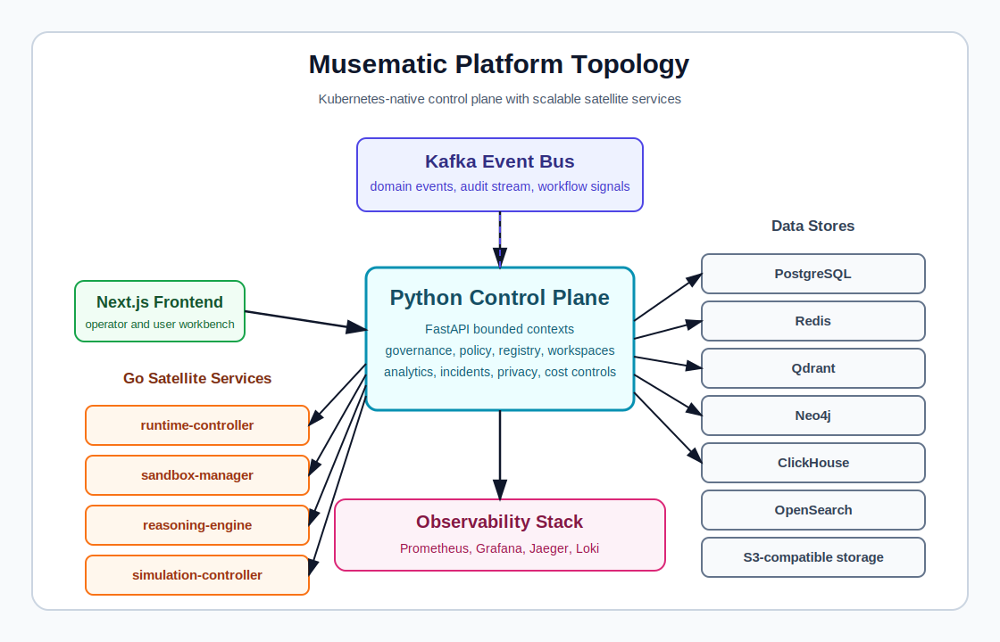

# Musematic - Piattaforma di mesh agentica

[](https://github.com/gntik-ai/musematic/actions/workflows/ci.yml)
[](./LICENSE)
[](https://kubernetes.io/releases/)
[](https://github.com/gntik-ai/musematic/releases)

> **Read this in other languages**: [English](./README.md) · [Español](./README.es.md) · [Italiano](./README.it.md) · [Deutsch](./README.de.md) · [Français](./README.fr.md) · [简体中文](./README.zh.md)

Musematic e una piattaforma aperta per gestire flotte di agenti IA con governance, osservabilita, valutazione e controllo dei costi di livello production. Offre ai team di piattaforma un control plane nativo Kubernetes per registrare agenti, orchestrare lavoro multi-agente, applicare policy, misurare qualita, tracciare decisioni e spostare workload tra ambienti locali, di laboratorio e cluster gestiti.

## Che cos'e Musematic?

Musematic e un motore di workflow e una piattaforma di agent operations per team che costruiscono sistemi IA autonomi e semi-autonomi. Fornisce il control plane condiviso attorno agli agenti: identita, ciclo di vita, applicazione delle policy, orchestrazione runtime, context engineering, memoria, valutazione, risposta agli incidenti, log, metriche, trace e governance dei budget.

La piattaforma e pensata per team di engineering, product, security e operations che devono eseguire agenti IA come workload di produzione responsabili, non come script isolati. Un workspace puo registrare agenti, comporre workflow, eseguire simulazioni, certificare proprieta di fiducia, osservare trace di ragionamento, confrontare risultati di valutazione e applicare policy di costo o sicurezza prima che il lavoro raggiunga utenti o sistemi esterni.

Musematic e volutamente portabile. Lo stesso sistema puo girare su cluster kind locali, piccoli laboratori k3s, deployment production su Hetzner o ambienti Kubernetes gestiti. La sua architettura separa un control plane Python da servizi satellite Go, cosi gli operatori possono scalare i percorsi di esecuzione sensibili alla latenza mantenendo centralizzati governance e audit.

## Capacita principali

- **Gestione del ciclo di vita degli agenti**: registrare, revisionare, certificare, dismettere e scoprire agenti tramite namespace pienamente qualificato.
- **Orchestrazione multi-agente**: coordinare obiettivi di workspace, workflow, flotte, approvazioni, retry ed esecuzione hot-path.
- **Fiducia e conformita**: applicare policy tramite osservatori, giudici, enforcer, audit trail, controlli privacy e raccolta di evidenze.
- **Ragionamento**: eseguire modalita chain-of-thought, tree-of-thought, ReAct, debate, self-correction e scaling-inference tramite il reasoning engine.
- **Valutazione**: assegnare punteggi alle traiettorie, eseguire test semantici, confrontare esperimenti e monitorare indicatori di fairness o drift.
- **Osservabilita**: ispezionare metriche, log, trace, dashboard, alert ed eventi della catena di audit in tutta la piattaforma.
- **Governance dei costi**: attribuire la spesa per esecuzione, applicare budget, prevedere l'uso, rilevare anomalie e supportare il chargeback.
- **Portabilita**: distribuire su kind, k3s, Hetzner, Kubernetes gestito o bare metal con workflow Helm standard.

## Avvio rapido

Cinque minuti per un'installazione locale di sviluppo con cache calda:

```bash
git clone https://github.com/gntik-ai/musematic.git
cd musematic
make dev-up
open http://localhost:8080
```

`make dev-up` crea o riutilizza l'ambiente locale basato su kind, installa i chart Helm e inserisce i dati di test usati dall'harness end-to-end. Le prime esecuzioni possono richiedere piu tempo mentre vengono scaricate immagini Docker e dipendenze dei chart.

Usa questi comandi di supporto durante lo sviluppo:

```bash
make dev-logs
make dev-down
make dev-reset
```

Consulta la [guida allo sviluppo](./docs/developer-guide/) e la [guida operativa](./docs/operator-guide/) per dettagli piu approfonditi su setup e gestione.

## Opzioni di installazione

| Target | Caso d'uso | Guida |
|---|---|---|
| kind | Sviluppo locale e test end-to-end simili alla CI | [Installazione kind](./docs/installation/kind.md) |
| k3s | Laboratori single-node e piccoli ambienti | [Installazione k3s](./docs/installation/k3s.md) |
| Hetzner con load balancer | Cluster self-managed orientati alla produzione | [Installazione Hetzner](./docs/installation/hetzner.md) |
| GKE, EKS o AKS | Deployment Kubernetes gestiti | [Installazione Kubernetes gestita](./docs/installation/managed-k8s.md) |

Tutte le modalita di installazione usano gli stessi chart Helm di proprieta del repository in `deploy/helm/` e gli stessi contratti del control plane.

## Architettura in sintesi



Musematic usa un'architettura composta da control plane e servizi satellite. Il control plane Python possiede orchestrazione API, servizi dei bounded context, policy, record di audit e integrazioni. I servizi satellite Go possiedono responsabilita runtime sensibili alla latenza: avvio dei pod agent, sandboxing dell'esecuzione del codice, esecuzione delle modalita di ragionamento e gestione delle simulazioni.

Kafka trasporta eventi di dominio tra bounded context. PostgreSQL conserva lo stato relazionale, Redis mantiene contatori hot e lease, Qdrant conserva embedding vettoriali, Neo4j conserva relazioni di knowledge graph, ClickHouse conserva rollup analitici, OpenSearch offre ricerca full-text e lo storage compatibile S3 mantiene gli artefatti piu grandi.

Il frontend e un'applicazione Next.js che consuma contratti tipizzati REST, WebSocket e client generati. L'osservabilita e una capacita di primo livello: Prometheus, Grafana, Jaeger e Loki fanno parte del modello di deployment, e le dashboard sono versionate nella superficie dei chart Helm.

La piattaforma e progettata affinche la governance resti centralizzata mentre l'esecuzione resta scalabile. Gli operatori possono aggiungere nuovi bounded context o capacita satellite senza bypassare identita, policy, telemetria e audit comuni.

## Documentazione

- [Guida all'amministrazione](./docs/admin-guide/)
- [Guida operativa](./docs/operator-guide/)
- [Guida allo sviluppo](./docs/developer-guide/)
- [Guida utente](./docs/user-guide/)
- [Integrazioni](./docs/admin-guide/integrations.md)
- [Guida alla creazione di agenti](./docs/developer-guide/building-agents.md)
- [Architettura di sistema](./docs/system-architecture-v6.md)
- [Architettura software](./docs/software-architecture-v6.md)
- [Requisiti funzionali](./docs/functional-requirements-revised-v6.md)

## Contribuire

Consulta [CONTRIBUTING.md](./CONTRIBUTING.md) per le linee guida di contribuzione. Quel file di governance non fa parte di UPD-038 e puo essere aggiunto da una successiva attivita di amministrazione del repository.

## Licenza

Consulta [LICENSE](./LICENSE) per i termini di licenza. Se il file e assente in un checkout, considera il progetto come non ancora dotato di una licenza open source dichiarata finche i maintainer del repository non ne aggiungono una.

## Comunita e supporto

- Issues: [GitHub Issues](https://github.com/gntik-ai/musematic/issues)
- Discussioni: usa [GitHub Issues](https://github.com/gntik-ai/musematic/issues) finché GitHub Discussions non sarà abilitato.
- Releases: [GitHub Releases](https://github.com/gntik-ai/musematic/releases)
- Segnalazione di sicurezza: consulta [SECURITY.md](./SECURITY.md) per la guida alla divulgazione responsabile.
