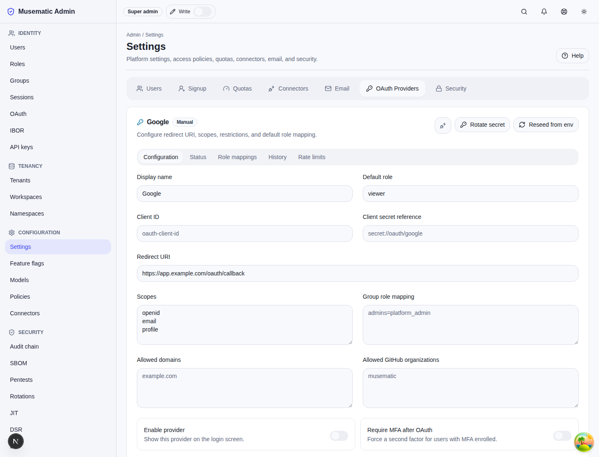
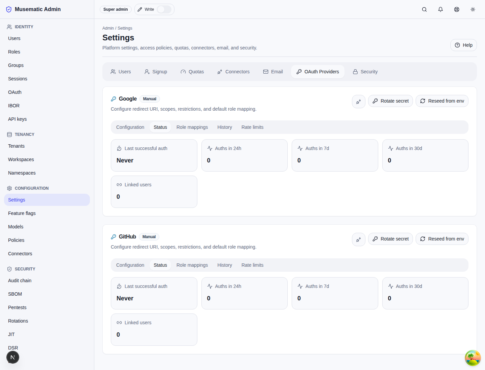
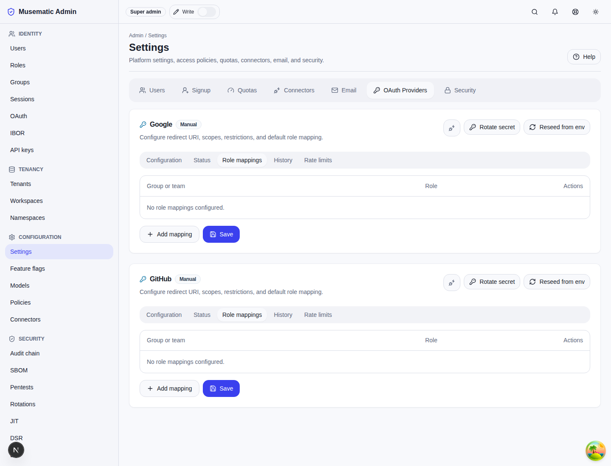
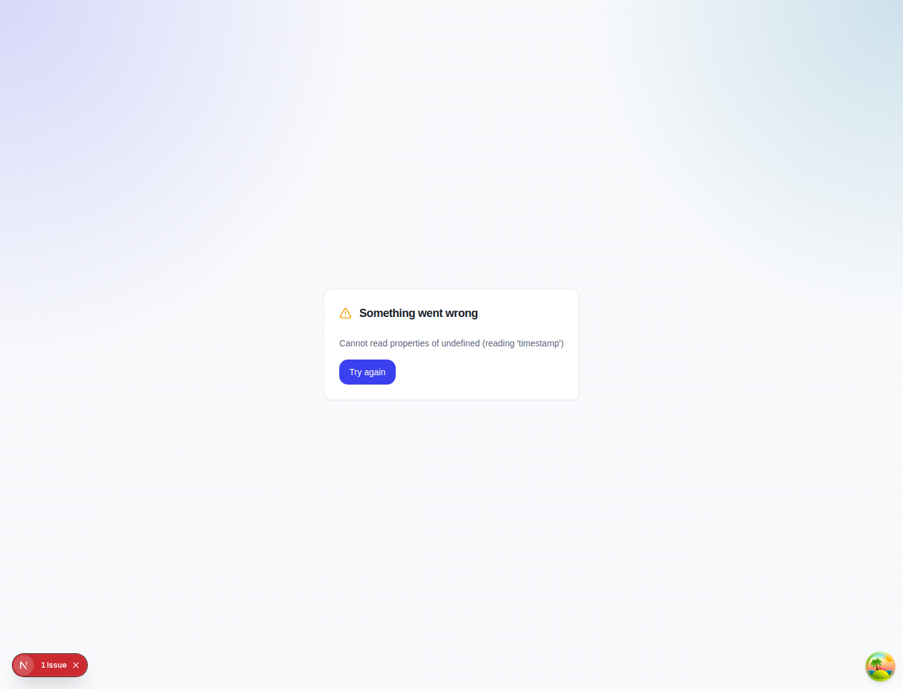
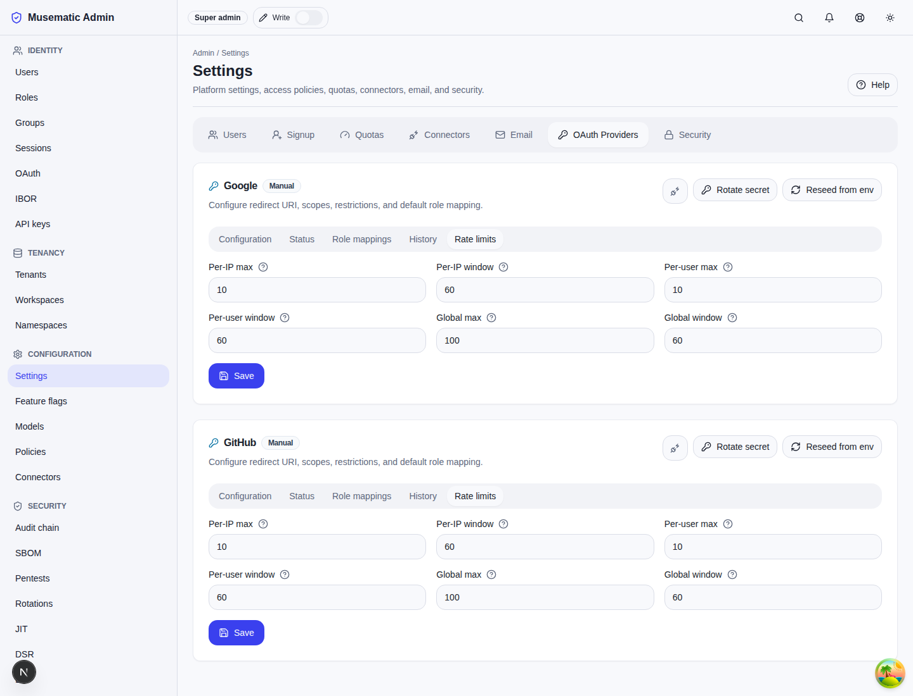

# OAuth Providers

OAuth provider settings live in `/admin/settings?tab=oauth`. Platform admins can configure Google and GitHub providers, inspect source and health state, rotate secrets, test connectivity, manage role mappings, review history, and tune per-provider rate limits.

Use this page for provider-level administration after install-time bootstrap has created the initial rows. GitOps-managed providers keep `source=env_var` until an admin edits them manually or imports a promoted configuration.

## Source And Status

Each provider shows a source badge:

- `env_var`: created or reseeded from `PLATFORM_OAUTH_*` bootstrap variables.
- `manual`: configured directly by an admin.
- `imported`: applied from `platform-cli admin oauth import`.

The status panel shows last successful authentication, recent auth counts, active linked users, and the latest connectivity result. Treat a missing last-auth timestamp as expected for a freshly bootstrapped provider that has not completed a user flow yet.

## Rotate Secret

Use rotation when an upstream client secret is expiring, suspected exposed, or scheduled for a routine change.

1. Create the replacement secret in the upstream Google or GitHub application.
2. Open the provider in `/admin/settings?tab=oauth`.
3. Choose the rotate-secret action and paste the replacement value into the write-only field.
4. Confirm that the request returns with no response body.
5. Run the provider connectivity test and complete one synthetic login before revoking the old upstream value.

The API writes a new Vault KV v2 version, flushes the provider cache, emits `auth.oauth.secret_rotated`, and returns `204 No Content`. Rule 44 applies: neither the current secret nor the replacement secret is returned, displayed, or written to audit metadata.

## Reseed From Environment

Reseed re-reads the running pod's `PLATFORM_OAUTH_GOOGLE_*` or `PLATFORM_OAUTH_GITHUB_*` variables. Use it after a Helm values change has reached the running control-plane pod and you want to apply that pod's environment without restarting again.

Without `force_update`, manual changes are preserved and the operation reports no changed fields when the provider already exists. With `force_update=true`, env-var values overwrite existing provider config and a critical `auth.oauth.config_reseeded` audit entry records the override. Rule 42 applies: normal bootstrap and reseed runs are idempotent, while force update is an explicit break-glass overwrite.

## Role Mappings

Google group mappings and GitHub team mappings map upstream group/team names to platform roles.

- Google mapping keys are group names or group email addresses such as `admins@example.com`.
- GitHub mapping keys are team references such as `example-org/platform-admins`.
- Mapping values must be existing platform roles.

Validation rejects malformed mapping keys and unknown roles. Mapping changes apply to future first-time OAuth logins only; existing user roles are not reconciled automatically.

## History

The history tab lists provider changes with timestamp, admin principal, action, and before/after diff. Use it to confirm bootstrap, reseed, import, rotation, role-mapping, and rate-limit changes.

Diffs identify changed fields and safe metadata only. They must not include plaintext client secrets.

## Rate Limits

The rate-limits tab controls per-IP, per-user, and global limits for each provider. Per-provider values take precedence over the global OAuth rate-limit defaults.

Raise limits only when provider traffic is known and monitored. Lower limits take effect on subsequent rate-limit checks and are recorded with `auth.oauth.rate_limit_updated`.

## Connectivity

Use test connectivity before enabling a provider or after changing redirect URI, client ID, scopes, domain/org allow-lists, or role mappings. Diagnostic messages should identify the failure class without exposing secrets.

If connectivity fails, check the redirect URI, client ID, upstream application status, org or domain allow-list, and network egress from the control-plane namespace. Rotate the secret only when the upstream secret is wrong or expired; do not rotate solely to clear a redirect or allow-list error.
