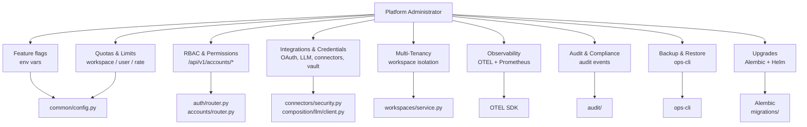

# Platform Administration

This section is for **platform administrators** — people who install and
run musematic for a whole organisation (or for many). It is distinct
from the end-user documentation in [Agents](../agents.md) and
[Flows](../flows.md).

!!! info "Admin vs. end-user responsibilities"

    | End users (creators, operators, consumers) | Platform administrators |
    |---|---|
    | Register agents and workflows inside a workspace they belong to. | Create and configure workspaces, invite users, set per-user workspace quotas. |
    | Run flows, inspect results and traces, review evaluations. | Provision OAuth providers, LLM providers, connector credentials, secrets. |
    | Open attention requests and workspace goals. | Configure the governance chain, policies, trust reviewers. |
    | Authenticate with email + MFA, or OAuth. | Decide the signup mode (`open` / `invite_only` / `admin_approval`). |
    | | Monitor the platform, wire in observability, operate incident response. |

!!! warning "No dedicated admin UI path yet"

    Admin operations are currently exposed through **REST endpoints**
    gated by the `platform_admin` or `superadmin` role. A dedicated
    `/admin/*` URL namespace is TODO — admins use the main UI with an
    admin role attached or call the API directly.

## The admin surface, at a glance

## Common admin tasks

Each linked page covers procedures, configuration keys, and RBAC
requirements:

- [Enabling Features](enabling-features.md) — flip feature flags, toggle
  subsystems (zero-trust, DLP, memory consolidation, etc.).
- [RBAC & Permissions](rbac-and-permissions.md) — 10 global roles, the
  workspace membership model, service accounts.
- [Quotas & Limits](quotas-and-limits.md) — per-user workspace cap,
  lockout thresholds, connector concurrency, memory rate limits, etc.
- [Integrations & Credentials](integrations-and-credentials.md) — OAuth
  providers, LLM endpoints, connectors (Slack / Telegram / email /
  webhook), the vault abstraction.
- [Multi-Tenancy](multi-tenancy.md) — workspace as the top-level
  isolation unit; how membership and visibility enforce it.
- [Observability](observability.md) — OTEL emit, Prometheus, Grafana,
  Jaeger; wiring in the stack.
- [Audit & Compliance](audit-and-compliance.md) — audit bounded
  context, where events land, retention.
- [Backup & Restore](backup-and-restore.md) — the `ops-cli backup` /
  `ops-cli restore` flows per [spec 048][s048].
- [Upgrades](upgrades.md) — Alembic migration chain, Helm rollout,
  feature-flag gating for breaking changes.

## Required admin roles

The majority of endpoints in this section require one of:

- **`superadmin`** — global wildcard. Use sparingly.
- **`platform_admin`** — global for `workspace`, `user`, `agent`,
  `connector` resource types with `read`/`write`/`delete`/`admin`
  actions.

Workspace-scoped admin operations (member management, workspace
settings) require **`workspace_owner`** or **`workspace_admin`** for
that specific workspace — see [RBAC & Permissions](rbac-and-permissions.md).

[s048]: https://github.com/gntik-ai/musematic/tree/main/specs/048-backup-restore
