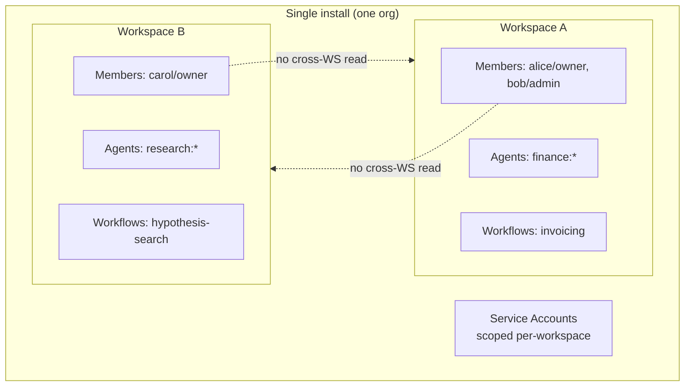

# Multi-Tenancy

musematic is **workspace-isolated**, not multi-tenant in the
conventional SaaS sense. One install serves one organisation; the
workspace is the primary isolation boundary.

## Isolation model



## Top-level isolation unit

The top-level unit is `workspaces_workspaces`. There is **no
organisation / tenant table** above it — workspaces are owned by
individual users via `Workspace.owner_id`.

A single musematic install is therefore single-organisation. To serve
multiple organisations, deploy multiple installs (separate namespaces
within a cluster, or separate clusters).

## Enforcement

### JWT + `X-Workspace-ID` header

Every API call carries:

- A JWT access token (`Authorization: Bearer ...`) that encodes the
  user's global role assignments.
- An `X-Workspace-ID` header (parsed in
  [`apps/control-plane/src/platform/common/dependencies.py`][deps])
  that names the workspace the caller is acting in.

The `RBACEngine` ([`auth/rbac.py`][rbac]) then resolves the user's
permissions **for that workspace**:

- `global` scope → applies regardless of header.
- `workspace` scope → permission's `workspace_id` must match the header.
- `own` scope → principal must be the resource owner.

### Membership check

Before any workspace-scoped read or write, the control plane verifies
the user has a `Membership` row in `workspaces_memberships` for the
target workspace. Non-members see `404 Not Found` (intentional — leaks
nothing about existence).

### Zero-trust visibility for agents

Within a workspace, agents themselves are also isolated by default
(principle IX). See [spec 053][s053] and
[Enabling Features — zero trust](enabling-features.md#visibility_zero_trust_enabled).

### Row-level-security in the database

The control plane enforces isolation in the service layer, not via
Postgres RLS. Every bounded context's repository queries include an
explicit `WHERE workspace_id = ?` clause. Principle IV forbids
cross-boundary DB access and makes this pattern mandatory.

## Creating a workspace

```http
POST /api/v1/workspaces
Content-Type: application/json

{
  "name": "finance-ops",
  "description": "Finance operations"
}
```

- Subject to `User.max_workspaces` (or global `WORKSPACES_DEFAULT_LIMIT`).
- The caller becomes `workspace_owner` automatically.
- A default namespace + no-op policy are auto-provisioned per
  [spec 018][s018].

## Suspending / deleting a workspace

The workspace model uses soft deletion (`SoftDeleteMixin`). Workflow:

1. `PATCH /api/v1/workspaces/{id}` with `{"status": "archived"}` to
   archive.
2. Archived workspaces are hidden from listings but retained for audit
   purposes.
3. `DELETE /api/v1/workspaces/{id}` marks `deleted_at`; cascade cleanup
   of agents, workflows, and memberships runs asynchronously.

TODO(andrea): confirm the cascade-deletion worker name and Kafka topic.

## When to deploy multiple installs

Choose separate installs when:

- Organisations must not share data store connections (regulatory).
- Per-organisation SLAs demand separate node pools or regions.
- Billing / cost attribution must be physically separated.

A shared install with per-workspace isolation is appropriate when:

- Users from one organisation.
- Multiple projects / teams who need separation but share platform ops.

## Future direction

The constitution's audit-pass (v1.2.0) introduces a `multi_region_ops`
bounded context and a "region as first-class dimension" architecture
decision (AD-21). This will add cross-region workspace replication and
residency controls. As of the main branch those capabilities are
planned, not implemented — see
[Roadmap](../roadmap.md).

[deps]: https://github.com/gntik-ai/musematic/blob/main/apps/control-plane/src/platform/common/dependencies.py
[rbac]: https://github.com/gntik-ai/musematic/blob/main/apps/control-plane/src/platform/auth/rbac.py
[s018]: https://github.com/gntik-ai/musematic/tree/main/specs/018-workspaces-bounded-context
[s053]: https://github.com/gntik-ai/musematic/tree/main/specs/053-zero-trust-visibility
