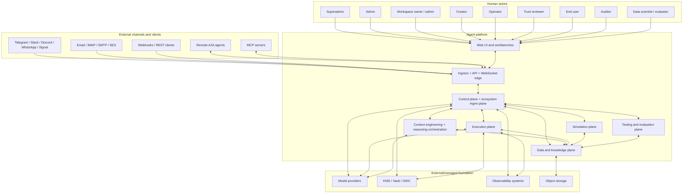
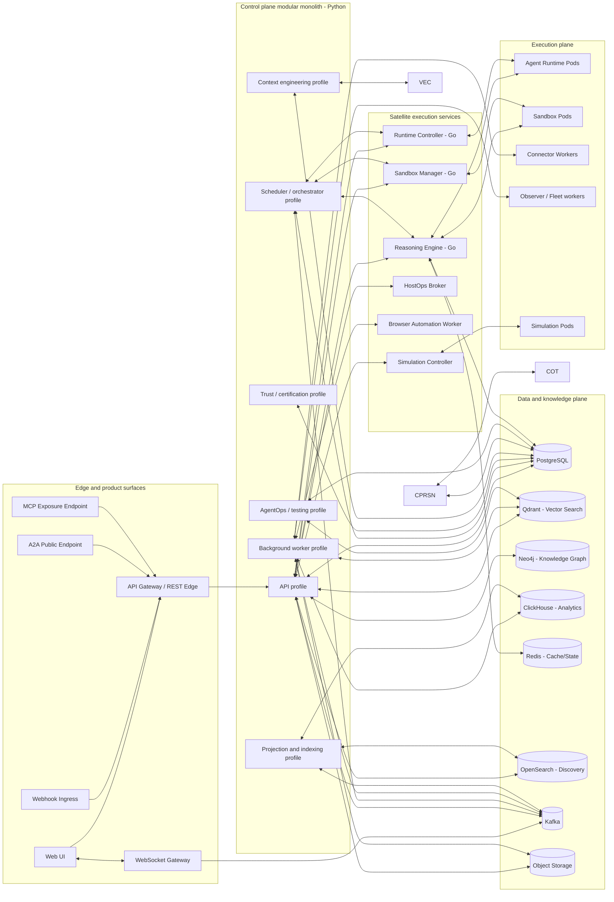
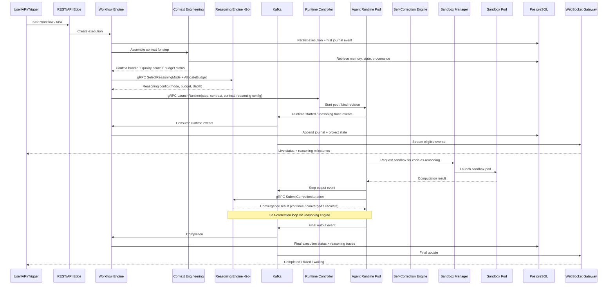

# Product System Architecture (v5 — Audit Pass + UPD-035 Capstone)

Navigation: [Architecture Overview](index.md) | [Bounded Contexts](bounded-contexts/index.md) | [Data Stores](data-stores.md) | [Event Topology](event-topology.md) | [Security, Trust, and Privacy](security-trust-privacy.md) | [Architecture Decisions](architecture-decisions.md)


Version: 2.0
Scope baseline: 391 functional requirements + 375 technical requirements = 766 total requirements covered
Primary implementation stance: modular monolith for the control plane, extraction-ready from day 1
Primary deployment target: Kubernetes
Public streaming protocol: WebSockets
Internal service protocol: gRPC
Event backbone: Kafka
Interoperability baseline: MCP + A2A first-class
Context engineering: first-class architectural subsystem
Reasoning orchestration: budgetable, auditable, adaptive
Self-correction: native runtime capability with convergence detection
Simulation: isolated execution environment for what-if analysis

---

## 1. Purpose of this document

This document defines the **system architecture** of the product as a complete production platform for multi-tenant, policy-governed, workflow-driven, multi-agent execution with advanced context engineering, reasoning orchestration, self-correction, resource-aware optimization, scientific discovery, privacy-preserving collaboration, marketplace intelligence, fleet-level learning, agent simulation, AgentOps lifecycle management, and semantic/behavioral testing.

It is intentionally broader than a typical application architecture because the product is not only a web application. It is a full platform that includes:
- a user-facing product surface;
- an ecosystem management plane;
- deterministic workflow execution;
- isolated agent runtimes with native self-correction and reasoning budget controls;
- sandboxed code execution including code-as-reasoning support;
- connector ingress and egress;
- event-driven multi-agent coordination;
- registry, marketplace, monitor, interactions server, and workbenches;
- trust, certification, and governance services;
- factory capabilities for agents and fleets including AI-assisted composition;
- context engineering with quality scoring, provenance, budget enforcement, and compaction;
- advanced reasoning orchestration with chain-of-thought persistence, tree-of-thought branching, and adaptive depth;
- resource-aware optimization with dynamic model switching, cost intelligence, and graceful degradation;
- scientific discovery workflows with hypothesis generation, tournament ranking, and generate-debate-evolve cycles;
- privacy-preserving collaboration with differential privacy and data minimization;
- marketplace intelligence with recommendation engines and usage-based quality signals;
- fleet-level learning with performance profiles, adaptation, and knowledge transfer;
- agent simulation and digital twin capabilities;
- AgentOps with behavioral versioning, governance-aware CI/CD, and canary deployments;
- semantic and behavioral testing with adversarial generation, drift detection, and statistical robustness;
- memory, evaluation, experimentation, and observability subsystems.

This document answers the system-level questions:
- What are the major planes and deployable elements?
- How do users, agents, fleets, connectors, sandboxes, and remote systems interact?
- How is the system deployed on Kubernetes?
- How are security, trust, resilience, privacy, and governance enforced end to end?
- How do context engineering, reasoning, self-correction, and resource optimization integrate with the execution plane?
- How does the architecture cover the full revised requirement set?

The complementary file, `software-architecture.md`, goes deeper into bounded contexts, modules, domain objects, internal APIs, runtime contracts, and extraction seams.

---

## 2. Locked input decisions

The architecture below treats the following as fixed decisions:

1. The target is the **complete target architecture**, not a reduced MVP-only shape.
2. The primary implementation model for the control plane is a **modular monolith**, not day-1 microservices.
3. The operating model is **hybrid/self-hosted friendly**: the platform can run fully self-hosted, but managed equivalents for stateful dependencies are acceptable.
4. **WebSockets** are the canonical public real-time streaming mechanism.
5. **gRPC** is the canonical internal protocol for high-value service-to-service control paths.
6. **Kafka** is the durable event backbone.
7. **MCP and A2A** are first-class from version 1.
8. The following capabilities are in-scope in the initial target architecture: marketplace, registry, monitor, interactions server, consumer/creator/trust/operator/**administrator** workbenches, certification/trust framework, agent factory, fleet factory, context engineering, reasoning orchestration, self-correction engine, resource-aware optimization, agent composition, scientific discovery, privacy-preserving collaboration, marketplace intelligence, fleet-level learning, agent simulation, AgentOps, and semantic/behavioral testing.
9. High-privilege operational capabilities are allowed even in **shared multi-tenant mode**, but only under strict governance, approval, isolation, and audit controls.
10. The primary physical deployment view in this document is **Kubernetes**.
11. **Dedicated purpose-built data stores from day 1**: PostgreSQL for relational truth, **Qdrant** for vector search, **Neo4j** for knowledge graph, **ClickHouse** for analytics/OLAP, **Redis** for caching and ephemeral state, **OpenSearch** for full-text marketplace discovery. Each store is justified by workload characteristics, not premature optimization.
12. **Reasoning orchestration and self-correction** are implemented as a **separate Go service** (`reasoning-engine`) alongside the runtime controller, optimized for low-latency hot loops, budget tracking, and convergence detection. Context engineering remains in the Python monolith initially.

---

## 3. Coverage statement

> **v3 update:** This revision incorporates all changes from the Agentic Design Patterns (Gulli, Springer 2025) and Agentic Mesh (Broda & Broda, O'Reilly 2026) deep analysis, plus the S3 storage genericization. FR coverage is now FR-001 through FR-447 (446 active).

This architecture is designed to cover the full current requirements baseline:

- **Functional requirements:** 391
- **Technical requirements:** 375
- **Total:** 766

Coverage is asserted at three levels:

1. **Architectural capability coverage**: every requirement family maps to at least one explicit architectural component or subsystem.
2. **Operational coverage**: deployment, runtime, observability, governance, recovery, and lifecycle requirements all have named realization points.
3. **Control-point coverage**: every high-risk or cross-cutting concern has an explicit enforcement or decision point rather than relying on informal convention.

---

## 4. Architecture mission

The product must behave simultaneously as:

- a **multi-tenant enterprise platform**;
- an **agentic workflow system**;
- a **runtime isolation and sandboxing platform**;
- a **registry- and marketplace-driven ecosystem** with intelligent recommendation;
- a **trust and certification system**;
- a **fleet and multi-agent coordination environment** with fleet-level learning;
- a **governed automation fabric** with privacy-preserving collaboration;
- a **developer/operator factory** for repeatable agent and fleet creation including AI-assisted composition;
- a **context engineering platform** with quality scoring, provenance, budget management, and adaptive compaction;
- a **reasoning orchestration platform** with chain-of-thought persistence, tree-of-thought branching, and adaptive reasoning depth;
- a **self-correcting execution platform** with convergence detection and multi-agent review loops;
- a **resource-aware optimization platform** with dynamic model switching, cost intelligence, and graceful degradation;
- a **scientific discovery platform** with hypothesis generation, tournament ranking, and experiment coordination;
- an **agent simulation platform** with digital twins and behavioral prediction;
- an **AgentOps platform** with behavioral versioning, governance-aware CI/CD, canary deployment, and automated retirement;
- a **semantic and behavioral testing platform** with adversarial generation, drift detection, and human-AI collaborative grading.

Accordingly, the architecture must satisfy ten non-negotiable system goals:

### 4.1 Deterministic control over non-deterministic intelligence

LLM-driven behavior is probabilistic. The system architecture must therefore make **execution state, event history, policy decisions, reasoning traces, self-correction iterations, context assemblies, and tool calls durable, replayable, explainable, and governable**.

### 4.2 Strong separation between management and execution

The architecture must isolate:
- human-facing control surfaces;
- persistent system-of-record services;
- agent runtime execution;
- sandbox execution;
- privileged infrastructure operations;
- simulation environments.

### 4.3 Multi-tenancy without policy ambiguity

Every resource, secret, event stream, agent share, fleet membership, prompt asset, model credential, context assembly, reasoning trace, and workbench action must be scoped and attributable.

### 4.4 Mesh-scale discovery and coordination

The product must support agent and fleet discovery, registry-backed metadata, marketplace discovery with intelligent recommendation, direct A2A collaboration, MCP-based tool/resource access, and event-driven coordination at scale.

### 4.5 Enterprise-grade governance and trust

The platform must implement identity, authorization, purpose-bound policy, explainability, observability, certification, recertification, revocation, privacy impact assessment, and lifecycle governance as first-class architectural layers.

### 4.6 Operational sustainability

The architecture must be fit for build/release automation, diagnostics, upgrade safety, rollback, disaster recovery, audit export, performance tuning, and long-term product evolution.

### 4.7 Context-aware intelligence

The platform must treat context engineering as a first-class discipline with dedicated infrastructure for assembly, quality scoring, provenance tracking, budget enforcement, and compaction.

### 4.8 Controllable reasoning

Reasoning must be budgetable, auditable, and adaptive. The platform must support multiple reasoning modes, persist reasoning traces, and enforce reasoning budgets as a resource class alongside tokens, cost, and time.

### 4.9 Resource-conscious execution

The platform must continuously optimize resource allocation through dynamic model switching, cost intelligence, graceful degradation, and learned allocation policies.

### 4.10 Observable agent lifecycle

Every agent must have a trackable behavioral lifecycle from creation through testing, deployment, monitoring, adaptation, and eventual retirement, managed through AgentOps.

---

## 5. Architecture principles

The system is governed by the following principles.

### 5.1 Externalized ecosystem management plane

Registry, monitor, interactions, marketplace, and workbenches are not embedded ad hoc inside agents. They live in the platform control plane and act as shared governance and visibility infrastructure.

### 5.2 Control-plane / execution-plane separation

The control plane stores truth and makes decisions. The execution plane performs work. Agents do not become the source of truth for workflow state, audit state, or governance state.

### 5.3 Journal-first workflow semantics

The append-only execution journal is the authoritative record of workflow progress. Current state is projected from journaled events, not maintained as an opaque mutable blob.

### 5.4 Policy is machine-enforced, not implied by prompts

Markdown files, prompt assets, and `TOOLS.md` describe expected behavior, but they never constitute the effective enforcement model. Enforcement is handled by structured policies, gateways, and approval systems.

### 5.5 Event-driven where asynchronous; gRPC where controlled

Kafka is used for durable asynchronous coordination, replay, fan-out, backlog visibility, observer access, and recovery. gRPC is used for high-fidelity internal control paths such as runtime and sandbox orchestration.

### 5.6 Identity and purpose travel with every action

All important operations carry actor identity, workspace scope, purpose, policy context, correlation identifiers, and trust level.

### 5.7 Isolation by default

Agent runtimes and sandbox runtimes are separate execution domains. Privileged operations are not available directly to agents. Shared-mode privileged capabilities require dedicated brokered paths. Simulation environments are isolated from production.

### 5.8 Registry-backed discoverability

Discoverability must come from structured metadata in the registry, not only from raw search or naming conventions.

### 5.9 Factories, not handcrafted snowflakes

Agent creation, fleet creation, publication readiness, certification, telemetry hooks, and lifecycle hooks are designed as repeatable platform capabilities, extensible through AI-assisted composition.

### 5.10 Extraction-ready modularity

Even though the control plane is a modular monolith, every bounded context is designed so it can be extracted later if justified by load, team topology, or compliance pressure.

### 5.11 Context quality as a measurable property

Context assembly is not fire-and-forget concatenation. Every context assembly has a quality score, a provenance chain, a budget envelope, and a drift indicator.

### 5.12 Reasoning as a budgetable resource

Reasoning tokens, deliberation rounds, and thinking time are managed resources alongside regular tokens, cost, and wall-clock time. The platform allocates, tracks, and enforces reasoning budgets through a dedicated high-performance Go service optimized for low-latency budget tracking and convergence detection.

### 5.13 Self-correction as convergent, not unbounded

Self-correction loops must have convergence detection, iteration limits, cost caps, and human escalation triggers. Unbounded retry loops are an anti-pattern.

### 5.14 Privacy by design

Cross-scope data flows, memory operations, and telemetry aggregation are subject to data minimization, differential privacy where configured, and anonymization before crossing trust boundaries.

### 5.15 Behavioral lifecycle is observable

Every agent has a behavioral history — not just a code history — tracked through evaluation metrics, reasoning patterns, output quality, and drift indicators over time.

---

## 6. System context

### 6.1 Human actors

- **Superadmin**: global security, trust, deployment, limits, and platform governance.
- **Admin**: tenant/platform administration, signup/approval, email and connector policy, quotas.
- **Workspace owner/admin**: workspace settings, membership, connectors, goals, subscriptions, shares.
- **Creator**: agent and fleet author, prompt asset owner, connector integrator, template user, AI-assisted composition user.
- **Operator**: runtime health, queue backlog, execution controls, diagnostics, rollback, fleet health monitoring, reasoning budget monitoring.
- **Trust reviewer / certifier**: policy attachment, evidence review, certification lifecycle, privacy impact review.
- **End user / consumer**: task launch, conversation participation, workspace collaboration, marketplace discovery.
- **Auditor / compliance reviewer**: read-only inspection of approved traces, policies, evidence, audit exports, reasoning traces, self-correction logs.
- **Data scientist / evaluator**: evaluation suite management, A/B experiment design, semantic testing, adversarial testing, behavioral drift analysis.

### 6.2 External machine actors

- **Channel providers**: Slack, Telegram, Discord, WhatsApp, Signal, email, webhook callers, REST clients.
- **Model providers**: LLM, embedding, classifier, reasoning, safety-model backends.
- **External secret and identity providers**: OAuth/OIDC (Google, GitHub, enterprise SSO), KMS, Vault, IBOR (LDAP/AD/Keycloak/Okta).
- **Remote agents**: A2A-capable agents in external ecosystems.
- **MCP servers**: external tool/resource servers.
- **Storage and search systems**: object storage, search, graph, vector backends.
- **Observability systems**: Prometheus, OpenTelemetry collectors, alerting systems.

### 6.3 Core platform responsibility boundary

The platform is responsible for:
- identity, tenancy, governance, certification, and audit;
- durable workflow state, journals, and replay;
- agent catalog and ecosystem metadata;
- runtime and sandbox orchestration;
- connectors, event routing, and workbench surfaces;
- context engineering with quality scoring and provenance;
- reasoning orchestration with budget management;
- self-correction with convergence detection;
- resource-aware optimization with cost intelligence;
- agent and fleet composition including AI-assisted generation;
- scientific discovery orchestration;
- privacy-preserving collaboration;
- marketplace intelligence and recommendation;
- fleet-level learning and adaptation;
- agent simulation and digital twins;
- AgentOps lifecycle management;
- semantic and behavioral testing;
- evaluation, search, memory, learning consolidation, and operational tooling.

It is **not** responsible for replacing every external enterprise system. It integrates with them through connectors, tools, MCP, A2A, REST, and governed execution adapters.

### 6.4 System context diagram



---

## 7. Macro architecture: planes and major subsystems

The system is organized into nine logical planes.

## 7.1 Experience plane

The experience plane contains all human-facing and API-consumer-facing entry points.

### Components

- Web UI (Next.js/React)
- Public REST API
- WebSocket gateway
- Webhook ingress
- Public A2A endpoint
- MCP exposure endpoint where applicable
- Authentication entry points
- Marketplace search and browsing surfaces with intelligent recommendation
- Consumer, creator, trust, operator, and **administrator** workbenches
- Evaluation and testing workbench

### Responsibilities

- user and admin interaction;
- authenticated streaming and notifications;
- channel ingress normalization;
- API contract enforcement;
- workbench BFF composition;
- surface-level rate limiting and idempotency;
- external interaction negotiation;
- context quality visualization;
- reasoning trace inspection;
- self-correction iteration review;
- behavioral drift dashboards;
- simulation comparison views.

## 7.2 Ecosystem management plane

This is the mesh-specific management layer inspired by the agentic mesh model. It is logically inside the control plane but deserves its own architectural identity because it carries discoverability, trust, marketplace intelligence, and ecosystem governance.

### Components

- Registry service / bounded context
- Marketplace service / BFF with recommendation engine
- Monitor service with fleet-level aggregation
- Interactions service with conversation branching support
- Consumer workbench backend
- Creator workbench backend with AI-assisted composition
- Trust workbench backend with privacy impact assessment
- Operator workbench backend with reasoning budget monitoring
- Agent and fleet discovery services with contextual suggestions
- Trust signal projection and feedback subsystem
- Quality signal aggregator
- Agent health scorer

### Responsibilities

- authoritative metadata;
- ecosystem discovery with intelligent recommendation;
- marketplace publication and invocation readiness;
- interaction start/status/update APIs;
- trust and certification surfaces;
- operator drill-down with reasoning trace inspection;
- fleet and ecosystem visibility with performance profiles;
- agent health scoring and behavioral regression detection;
- privacy impact assessment surfaces;
- contextual discovery suggestions within workbenches.

## 7.3 Control plane

The control plane is the policy- and state-owning brain of the platform.

### Components

- API application / modular monolith
- Identity and access module
- Workspace and membership module
- Registration, subscription, and approval module
- Billing module for plans, subscriptions, quota enforcement, overage authorization, and payment-provider orchestration
- Agent ingest and catalog module with maturity classification
- Workflow definition, compilation, and versioning module
- Workflow execution state and scheduler module with priority engine
- Policy module with purpose-bound authorization
- Trust and certification module
- Fleet management module with adaptation engine
- Prompt asset and context assembly module with quality scoring
- Evaluation and experiment module with statistical robustness testing
- Audit and retention module
- Analytics and reporting module with cost intelligence
- Notification orchestration module
- Search/query projections module
- Hook engine and background jobs module
- Installer and operations CLI
- Context engineering service with provenance, budget enforcement, compaction
- Resource-aware optimization service with dynamic model routing
- Reasoning coordination adapter (thin client to the Go reasoning engine)
- Self-correction coordination adapter (thin client to the Go reasoning engine)
- Agent composition engine (agent-builds-agent)
- Scientific discovery orchestrator with hypothesis management and tournament ranking
- Privacy-preserving computation module with differential privacy and data minimization
- Marketplace intelligence module with recommendation and quality signal aggregation
- Fleet learning and adaptation module
- AgentOps service with behavioral versioning and canary control
- Semantic and behavioral testing engine

### Responsibilities

- business truth;
- tenant scoping;
- policy and trust decisions;
- workflow semantics and journal ownership;
- registry ownership;
- evaluation and KPI ownership;
- lifecycle governance;
- context quality management;
- reasoning budget enforcement;
- self-correction convergence tracking;
- resource allocation optimization;
- agent and fleet composition;
- hypothesis and experiment coordination;
- privacy policy enforcement;
- behavioral lifecycle management;
- semantic testing orchestration.

## 7.4 Execution plane

The execution plane carries isolated work.

### Components

- Runtime controller (Go)
- **Reasoning engine (Go)** — dedicated high-performance service for reasoning orchestration, self-correction loop management, budget tracking, and convergence detection
- Agent runtime pods
- Sandbox manager (Go)
- Sandbox pods (including code-as-reasoning sandbox support)
- Browser automation worker(s)
- Connector workers
- HostOps broker
- A2A runtime bridge
- MCP runtime bridge
- Fleet observer workers
- Broadcast/multicast delivery service
- Acknowledgment and delivery tracker
- Negotiation protocol engine

### Responsibilities

- spawn, supervise, and terminate runtimes;
- execute sandboxed code including code-as-reasoning;
- collect runtime heartbeats and events;
- broker tool access and high-risk operations;
- run channel IO workers;
- run browser or external-system action workers;
- support fleet orchestration and degraded execution;
- **orchestrate reasoning mode selection, budget allocation, and enforcement through the dedicated Go reasoning engine;**
- **manage self-correction loops through the reasoning engine with convergence detection;**
- **track chain-of-thought and tree-of-thought state with low-latency budget enforcement;**
- support broadcast and multicast messaging;
- track message acknowledgments and delivery;
- execute negotiation protocols for task assignment.

## 7.5 Data and knowledge plane

### Components

- **PostgreSQL 16+** — relational backbone for system-of-record, append-only journal, audit, metadata, policies, certifications, tenancy, and governance state
- **Qdrant** — dedicated vector search engine for semantic memory retrieval, agent recommendation, embedding-based similarity testing, context quality scoring, and pattern matching. Chosen for its native HNSW implementation, payload filtering, multi-tenancy support, and gRPC API for high-throughput retrieval
- **Neo4j** — dedicated graph database for knowledge graph queries, memory relationship traversal, workflow dependency analysis, fleet coordination graphs, agent-agent interaction analysis, and discovery evidence provenance chains. Chosen for its Cypher query language, native graph storage, and multi-hop traversal performance
- **ClickHouse** — dedicated OLAP engine for usage analytics, cost intelligence, behavioral drift detection, fleet performance profiling, quality signal aggregation, KPI computation, and time-series operational metrics. Chosen for its columnar storage, sub-second aggregation over billions of rows, and materialized view support
- **Redis 7+** — in-memory store for session caching, hot-path query caching, ephemeral rate-limit counters, reasoning budget tracking state, real-time leaderboards (hypothesis tournament scores), pub/sub for lightweight notifications, and distributed lock coordination. Chosen for its sub-millisecond latency, data structure versatility, and cluster mode for HA
- **OpenSearch** — dedicated full-text search engine for marketplace discovery, natural-language agent search, faceted filtering, hierarchical taxonomy navigation, saved views, and operator diagnostic queries. Chosen for its inverted index performance, BM25 relevance, aggregation framework, and dashboard integration
- **Apache Kafka** — durable event backbone for asynchronous coordination, replay, fan-out, backlog visibility, observer access, and recovery
- **S3-compatible object storage** (MinIO self-hosted or managed) — artifacts, reasoning traces, evidence bundles, simulation artifacts, large payloads
- Audit and evidence stores (PostgreSQL + object storage)
- Chain-of-thought trace store (PostgreSQL metadata + object storage payloads)
- Self-correction iteration store (PostgreSQL records + object storage payloads)
- Context provenance store (PostgreSQL)
- Hypothesis and experiment evidence store (PostgreSQL metadata + object storage)
- Digital twin store (PostgreSQL metadata + object storage state snapshots)
- Behavioral version store (PostgreSQL + ClickHouse time-series)
- Test case and adversarial scenario store (PostgreSQL + object storage)

### Responsibilities

- durable relational truth;
- durable streaming/replay backbone;
- object and artifact retention;
- search and discovery acceleration;
- memory and knowledge reuse;
- evidence, proof, and audit preservation;
- reasoning trace persistence;
- context provenance and quality history;
- self-correction convergence data;
- hypothesis and discovery evidence;
- digital twin state;
- behavioral version history;
- test suite and adversarial data management.

### Technology justification

| Subsystem | Technology | Justification | When to reconsider |
|---|---|---|---|
| Relational truth | PostgreSQL 16+ | ACID guarantees, append-only journal, mature ecosystem, pgcrypto for encryption, LISTEN/NOTIFY for lightweight notifications | Never — this is the backbone |
| Vector search | Qdrant | Native HNSW with configurable ef, payload filtering, multi-tenancy, gRPC API, horizontal sharding, snapshot backup | Milvus if GPU-accelerated search needed; Weaviate if hybrid search-native is preferred |
| Graph database | Neo4j | Cypher expressiveness, native graph storage, multi-hop traversal performance, APOC library, Bloom visualization | Amazon Neptune if managed-only is required; no replacement for v1 |
| Analytics/OLAP | ClickHouse | Columnar compression, sub-second aggregation over billions of rows, materialized views, time-series native, MergeTree engine family | Apache Druid if real-time ingestion latency <1s is critical |
| Full-text search | OpenSearch | BM25 relevance, inverted index, faceted aggregation, synonym/analyzer pipelines, dashboard integration | Elasticsearch if license compatibility preferred |
| Caching | Redis 7+ (Cluster mode) | Sub-millisecond latency, data structures (sorted sets for leaderboards, streams for lightweight pub/sub), distributed locks, TTL eviction | Valkey as a drop-in open-source alternative |
| Event backbone | Apache Kafka | Durable streaming, replay, exactly-once semantics, consumer groups, compaction, partition ordering | Redpanda if JVM overhead is unacceptable |
| Object storage | S3-compatible (MinIO / managed) | Standard API, versioning, lifecycle policies, cross-region replication | No replacement needed |
| Embedding pipeline | Dedicated embedding service with batching | Async batch processing, GPU utilization, provider failover, rate-limit management | Inline if <100 embeddings/minute |

## 7.6 Trust, security, and governance plane

This plane cuts across all others.

### Components

- Authentication and identity integration
- RBAC and purpose-bound policy enforcement
- Governance compiler and bundles
- Tool gateway and memory write gate
- Certification workflows
- Approval gates
- Trust tiers and privilege model
- Proof chain / integrity chain
- Adversarial detection services (prompt injection, jailbreak, memory poisoning)
- Safety pipeline with layered guardrails
- Privacy impact assessment module
- Differential privacy engine
- Data minimization enforcer
- Anonymization pipeline

### Responsibilities

- zero-trust runtime posture;
- rightsizing access;
- certification and policy conformance;
- safety gating at input, prompt, output, tool, memory, and action stages;
- evidence production;
- irreversible action control;
- privacy policy enforcement including differential privacy;
- data minimization across scope boundaries;
- anonymization of cross-tenant telemetry;
- privacy impact assessment for context assemblies and memory operations.

## 7.7 Build, factory, and delivery plane

### Components

- Agent templates and scaffolds
- Fleet templates and topology descriptors
- SDKs and shared libraries
- Publication readiness pipelines
- Automated integration/resilience/conformance tests
- Release automation
- Certification pipeline hooks
- Internal extension registry
- Agent composition engine (AI-assisted)
- Fleet blueprint generator
- Governance-aware CI/CD controller
- Canary deployment controller
- Automated retirement controller

### Responsibilities

- make creation repeatable including AI-assisted composition;
- make governance enforceable before production;
- reduce unsafe one-off implementations;
- standardize observability, lifecycle, and identity hooks;
- support canary deployments with automatic promotion/rollback;
- support automated agent retirement on health degradation;
- gate deployments on evaluation results and behavioral regression checks.

## 7.8 Simulation and experimentation plane

This is a new architectural plane that provides isolated environments for what-if analysis, behavioral prediction, and experimentation.

### Components

- Simulation sandbox controller
- Digital twin store and manager
- Behavioral prediction engine
- A/B experiment coordinator
- Hypothesis tournament ranking engine
- Simulation comparison analytics
- Simulation isolation enforcer

### Responsibilities

- provide isolated execution environments for agent and fleet simulation;
- maintain digital twin representations of production agents;
- forecast agent/fleet behavior for given scenarios;
- coordinate A/B and canary experiments;
- rank hypotheses through tournament-style evaluation;
- enforce clear separation between simulation and production artifacts;
- provide simulation comparison analytics;
- expose the simulation run detail `<DigitalTwinPanel>` UI so operators and creators can compare mock-vs-real subsystems, divergence points, simulated time, and reference production executions without leaving the workbench.

## 7.9 Testing and quality plane

This plane provides the infrastructure for semantic, behavioral, and adversarial testing of agents **and** end-to-end (E2E) testing of the platform itself on an ephemeral Kubernetes cluster.

### Components

- Semantic similarity scorer
- Adversarial test generator
- Statistical robustness test runner
- Behavioral drift detector
- Multi-agent coordination test harness
- Human-AI collaborative grading pipeline
- Test case generation engine
- Evaluation artifact store
- **E2E test harness** (kind-based ephemeral cluster, pytest-based, Helm-driven install)
- **E2E test data seeder** (deterministic fixtures for all bounded contexts)
- **User journey test framework** (**17 cross-cutting journeys**: admin bootstrap, creator publication, consumer execution, workspace goal collaboration, trust governance, operator incident response, evaluator improvement, external A2A/MCP integration, scientific discovery, **privacy officer, security officer, finance owner, SRE multi-region, model steward, accessibility user, compliance auditor, dashboard consumer**)
- **Chaos injector** (pod kill, network partition, credential revocation, **Loki ingestion outage, Prometheus scrape failure, model provider total outage, residency misconfig, budget hard cap mid-execution, audit chain storage failure**)
- **Performance smoke test runner**
- **Observability assertion helpers** (Loki log presence with timeout, Prometheus metric tolerance, Jaeger trace structure, Grafana dashboard snapshot for reports, axe-core accessibility automation)

### Responsibilities

- evaluate agent outputs using embedding-based semantic similarity;
- generate adversarial test cases including prompt injection variants;
- execute statistical robustness tests with distribution-based verdicts;
- detect and alert on behavioral drift;
- evaluate multi-agent coordination quality;
- support human-AI collaborative grading workflows;
- auto-generate test scenarios from agent configuration;
- persist evaluation artifacts for audit and continuous improvement;
- **provision ephemeral kind clusters with full platform stack via production Helm charts**;
- **execute E2E test suites covering all bounded contexts on every PR**;
- **inject chaos scenarios (pod kills, partitions, credential failures) to verify resilience**;
- **run performance smoke tests to detect regressions on every PR**;
- **execute user journey tests simulating complete workflows per persona** (each journey crosses 4+ bounded contexts with 15+ assertion points);
- **publish JUnit XML and HTML test reports with platform state dumps on failure**.

---

## 8. High-level container view



### 8.1 Interpretation

- The **control plane remains a modular monolith** from a code ownership perspective.
- Multiple **runtime profiles** of the same monolith image are deployed independently on Kubernetes for scaling isolation. New profiles include **context engineering**, **reasoning orchestration**, and **AgentOps/testing**.
- Runtime control and sandbox control are kept as **separate satellite services** because they are infrastructure-heavy, isolation-sensitive, and protocol-heavy.
- A new **simulation controller** satellite manages isolated simulation environments.
- Kafka is the **asynchronous nervous system** of the platform.
- PostgreSQL is the **authoritative relational system of record**. Qdrant handles vector search, OpenSearch handles full-text discovery, Neo4j handles graph queries, ClickHouse handles analytics, and Redis handles caching and hot state.
- Object storage carries artifacts, archives, evidence, reasoning traces, and large outputs.
- Dedicated stores for chain-of-thought traces, hypotheses, and digital twins are logically separate concerns; their v1 physical backend may be PostgreSQL + object storage, but the architecture treats them as separate so they can be extracted.

---

## 9. Major system responsibilities by subsystem

## 9.1 Web UI

The Web UI exposes the complete product model:
- home/orientation surface;
- marketplace with recommendation and contextual discovery;
- conversations and workspace goals;
- creator workbench with AI-assisted composition;
- trust workbench with privacy impact review;
- operator workbench with reasoning budget monitoring and fleet health;
- analytics and reporting with cost intelligence;
- diagnostics and event drill-down;
- reasoning trace visualization;
- self-correction iteration review;
- behavioral drift dashboards;
- simulation comparison views;
- evaluation suite management and adversarial testing.

## 9.2 API gateway / REST edge

Responsible for:
- versioned REST APIs;
- token/session authentication;
- request validation and idempotency;
- public webhook authentication;
- public A2A entrypoints;
- rate limiting and audit context propagation.

## 9.3 WebSocket gateway

WebSockets are the canonical public streaming path. Responsible for:
- authenticated connection establishment;
- workspace/execution/conversation-scoped subscriptions;
- live execution updates including reasoning trace milestones;
- self-correction iteration progress;
- alerts and status notifications;
- operator and workbench push updates;
- backpressure and subscription hygiene.

## 9.4 Registry

The registry is the authoritative ecosystem metadata system of record for:
- agents and revisions with capability maturity levels;
- fleets and topologies;
- conversations and interactions;
- workspaces and workspace goals;
- policies and certifications;
- visibility, endpoint, capability, and trust metadata;
- reasoning mode support declarations;
- context engineering profile references.

## 9.5 Marketplace

The marketplace composes:
- registry metadata;
- trust signals;
- operational indicators;
- discovery indexes with intelligent recommendation;
- usage-based quality signals;
- access-request semantics;
- invocation readiness;
- contextual discovery suggestions within workbenches.

It supports natural-language search, hierarchical navigation, comparison views, policy-aware filtering, capability maturity filtering, and cost-performance matching.

## 9.6 Monitor

The monitor creates product-aware operational views for:
- agent-level health with health scoring;
- fleet-level health with performance profiles;
- queue backlog;
- execution dependencies;
- drift and anomaly signals including behavioral drift;
- workbench drill-down;
- reasoning budget consumption;
- self-correction effectiveness;
- context quality trends.

## 9.7 Interactions server

> **Update (v3):** Added workspace goal lifecycle (READY→WORKING→COMPLETE), Goal ID (GID) as first-class correlation dimension, configurable agent response decision mechanisms for workspace messages (LLM relevance, allowlist/blocklist, embedding similarity, best-match), and agent-initiated attention requests via dedicated Kafka topic (`interaction.attention`).

The interactions service owns the lifecycle of conversations, interactions, mid-process message injection, workspace-goal APIs, user-facing task progression, conversation branching and merging, and multi-interaction concurrency.

## 9.8 Workflow engine

The workflow engine owns:
- workflow YAML ingestion and compilation;
- versioned IR with reasoning mode hints and context budget constraints;
- execution journal including reasoning traces and self-correction iterations;
- scheduling with reasoning budget awareness;
- replay/resume/rerun semantics;
- safe updates and compatibility checks;
- retry/timeout/cancel/compensation behavior;
- priority and deadline-aware dispatch;
- reflection and self-correction loop orchestration;
- tree-of-thought branching support;
- debate round coordination.

## 9.9 Runtime controller

> **Update (v3):** Added warm pool management for <2s agent launch latency. Added secrets injection from vault — secrets never enter LLM context.

The runtime controller bridges logical execution to Kubernetes workloads. It owns:
- runtime pod creation and supervision;
- runtime state reconciliation;
- event collection including reasoning trace milestones;
- lease and heartbeat handling;
- stop/pause/resume orchestration;
- backend abstraction for future non-Kubernetes modes.

## 9.10 Sandbox manager

The sandbox manager provisions code execution sandboxes including code-as-reasoning sandboxes. It owns:
- template resolution;
- pod creation for sandboxes;
- resource and network policy application;
- artifact/log collection;
- cleanup and garbage collection.

## 9.11 HostOps broker

The HostOps broker provides:
- explicit allowlists;
- approval workflows;
- command and parameter validation;
- just-in-time authorization tokens;
- full audit and session capture;
- strong runtime isolation from ordinary agents.

## 9.12 A2A gateway

The A2A gateway supports:
- **auto-generated A2A Agent Cards** from registry metadata (FQN, purpose, capabilities, skills, authentication, input/output modes);
- **discovery endpoint**: `GET /.well-known/agent.json` (platform), `GET /a2a/agents/{fqn}/agent.json` (per-agent);
- **A2A task lifecycle**: submitted → working → input-required → completed / failed / canceled;
- **multi-turn conversations** within a single A2A task context;
- remote task correlation (via IID/GID);
- synchronous and asynchronous remote task calls;
- **SSE streaming** for task progress updates;
- policy-aware remote invocation (through tool gateway);
- identity and trust metadata on remote collaborations;
- **A2A client mode**: platform agents can discover and invoke external A2A-compliant agents via their Agent Card URLs.

## 9.13 MCP gateway

The MCP gateway handles:
- exposing platform resources as MCP capabilities;
- connecting to external MCP servers;
- capability mapping and negotiation;
- policy and visibility mediation.

## 9.14 Trust and certification subsystem

This subsystem owns:
- policy attachments;
- **agent contract management** (task scope, quality thresholds, cost/time limits, escalation conditions, enforcement policy);
- **contract compliance monitoring** (runtime checks against active contract terms);
- evidence ingestion;
- certification issuance/revocation/expiry/recertification;
- **third-party certifier registration and scoped access**;
- **ongoing surveillance program** (periodic reassessment, auto-recertification on material changes);
- trust signal publication;
- policy-aware ranking and filtering;
- governance bundle compilation and runtime enforcement hooks;
- **SafetyPreScreener** (rule-based, <10ms, hot-updatable);
- **tool output secret sanitization**;
- privacy impact assessment.

### 9.14a Governance pipeline subsystem (NEW)

The governance pipeline implements the Observer → Judge → Enforcer chain:
- **Judge agents** receive signals from observers, evaluate against policies, emit structured verdicts (COMPLIANT/WARNING/VIOLATION/ESCALATE_TO_HUMAN);
- **Enforcer agents** receive verdicts, execute enforcement actions (block, quarantine, notify, revoke-cert, log-and-continue);
- Governance chains are configurable per fleet and workspace;
- All verdicts and enforcement actions recorded in audit trail;
- Dedicated Kafka topics: `governance.verdict.issued`, `governance.enforcement.executed`.

## 9.15 Context engineering service

This is a new major subsystem. It owns:
- deterministic context assembly from multiple sources;
- context quality scoring with configurable criteria;
- provenance tracking for every context element;
- budget enforcement at step, execution, and agent levels;
- compaction strategies (relevance truncation, summarization, priority eviction, hierarchical compression, semantic deduplication);
- context A/B testing;
- context drift detection and alerting.

## 9.16 Reasoning engine (Go — separate satellite service)

This is a new major satellite service, implemented in **Go** for low-latency hot-loop performance. It runs alongside the runtime controller as a separate Kubernetes Deployment.

### Why Go and why separate
- Reasoning budget tracking requires **sub-millisecond latency** for per-token and per-round enforcement — Python's GIL and event-loop overhead are unacceptable for this hot path.
- Self-correction convergence detection involves **tight numerical loops** comparing quality metrics across iterations — Go's compiled performance is 10-50x faster than Python for this workload.
- Tree-of-thought branch management requires **concurrent goroutine coordination** for parallel branch evaluation — Go's concurrency model is purpose-built for this.
- The reasoning engine communicates with runtimes via **gRPC streaming** — Go's gRPC ecosystem is more mature and performant than Python's for bidirectional streaming.
- Keeping reasoning orchestration in the execution plane (alongside the runtime controller) **minimizes network hops** between the reasoning engine and the agent runtime pods it coordinates.

### Responsibilities
- reasoning mode selection (DIRECT, CHAIN_OF_THOUGHT, TREE_OF_THOUGHT, REACT, CODE_AS_REASONING, **DEBATE/Chain-of-Debates**, **SELF_CORRECTION**);
- reasoning budget allocation and real-time enforcement with sub-millisecond tracking (**Scaling Inference Law**: configurable `compute_budget` controls reasoning depth);
- chain-of-thought trace coordination and persistence;
- tree-of-thought branch management with concurrent evaluation;
- adaptive reasoning depth adjustment based on live quality signals;
- code-as-reasoning bridge to sandbox services;
- reasoning quality evaluation;
- self-correction loop execution with convergence detection;
- **Chain of Debates orchestration** (N agents × structured rounds: position → critique → rebuttal → synthesis → consensus check);
- **structured reasoning trace export** (JSON: technique, steps, tool calls, quality scores, token consumption, compute budget utilization);
- draft-critique-revision triple management;
- iteration and cost limit enforcement;
- human escalation routing on non-convergence;
- multi-agent review loop coordination (producer-reviewer patterns);
- self-correction analytics emission to Kafka.

### Primary interface
`ReasoningEngineService` over gRPC.

### gRPC methods
- `SelectReasoningMode(SelectReasoningModeRequest) returns (ReasoningModeConfig)`
- `AllocateReasoningBudget(AllocateReasoningBudgetRequest) returns (ReasoningBudgetEnvelope)`
- `StreamReasoningTrace(stream ReasoningTraceEvent) returns (ReasoningTraceAck)`
- `CreateTreeBranch(CreateTreeBranchRequest) returns (TreeBranchHandle)`
- `EvaluateTreeBranches(EvaluateTreeBranchesRequest) returns (BranchSelectionResult)`
- `StartSelfCorrectionLoop(StartSelfCorrectionRequest) returns (SelfCorrectionHandle)`
- `SubmitCorrectionIteration(CorrectionIterationEvent) returns (ConvergenceResult)`
- `GetReasoningBudgetStatus(GetBudgetStatusRequest) returns (BudgetStatusResponse)`
- `StreamBudgetEvents(StreamBudgetEventsRequest) returns (stream BudgetEvent)`

### Internal architecture
```
reasoning-engine/
  cmd/
    reasoning-engine/main.go
  internal/
    mode_selector/          # reasoning mode selection logic
    budget_tracker/         # real-time budget enforcement (Redis-backed for distributed state)
    cot_coordinator/        # chain-of-thought trace management
    tot_manager/            # tree-of-thought concurrent branch evaluation
    correction_loop/        # self-correction convergence detection
    quality_evaluator/      # reasoning quality scoring
    code_bridge/            # code-as-reasoning sandbox integration
    escalation/             # human escalation routing
  api/
    grpc/                   # gRPC service definitions
    events/                 # Kafka event producers
  pkg/
    metrics/                # convergence metrics, budget tracking
    persistence/            # PostgreSQL + Redis adapters
```

### State management
- **Hot state** (Redis): active reasoning budgets, live correction loop convergence metrics, tree branch scores, real-time leaderboards
- **Cold state** (PostgreSQL): completed reasoning traces, correction iteration records, budget consumption history, quality evaluation results
- **Large payloads** (Object storage): full chain-of-thought dumps, tree-of-thought branch payloads, correction draft-critique-revision artifacts

## 9.18 Resource-aware optimization service

This is a new major subsystem. It owns:
- task complexity classification;
- dynamic model routing based on complexity, cost, latency, and quality;
- context pruning orchestration;
- resource prediction before execution;
- graceful degradation when limits are reached;
- learned allocation policies from historical data;
- cost intelligence dashboards and recommendations.

## 9.19 Agent composition engine

This is a new major subsystem. It owns:
- AI-assisted agent blueprint generation from natural-language descriptions;
- fleet blueprint generation from mission descriptions;
- composition validation against platform constraints;
- composition audit trail;
- integration with certification and publication readiness pipelines.

## 9.20 Scientific discovery orchestrator

> **Update (v3):** Added Hypothesis Proximity Graph — embeddings in Qdrant, proximity edges in Neo4j, clustering for redundancy detection and landscape gap identification. Generation agent biased toward underrepresented clusters.

This is a new major subsystem. It owns:
- hypothesis generation workflow coordination;
- multi-agent hypothesis critique orchestration;
- Elo-based tournament ranking of hypotheses;
- experiment design workflow coordination;
- generate-debate-evolve cycle management;
- discovery evidence provenance chains.

## 9.21 Agent simulation environment

This is a new major subsystem. It owns:
- simulation sandbox provisioning (reuses sandbox infrastructure);
- digital twin management;
- behavioral prediction from historical patterns;
- simulation isolation enforcement;
- simulation comparison analytics.

## 9.22 AgentOps service

> **Update (v3):** Added agent adaptation pipeline (evaluate → identify improvements → propose config adjustments → human approval → apply as new revision). Self-correction convergence data feeds into adaptation signals. Context quality → performance correlation tracked.

This is a new major subsystem. It owns:
- behavioral versioning (tracking behavioral changes over time);
- governance-aware CI/CD gating;
- canary deployment management;
- behavioral regression detection;
- agent health scoring (composite of uptime, quality, safety, cost, satisfaction);
- automated retirement workflows.

## 9.23 Semantic and behavioral testing engine

> **Update (v3):** Added TrajectoryScorer (evaluates full execution path: path efficiency, tool appropriateness, reasoning coherence, cost-effectiveness; supports exact/in-order/any-order/precision/recall comparison methods; multi-agent cooperation scoring). Added LLM-as-Judge formalization with configurable rubrics, judge model selection, and calibration runs (N judgments → score distribution).

This is a new major subsystem. It owns:
- semantic similarity scoring using embeddings;
- adversarial test case generation;
- statistical robustness test execution;
- behavioral drift detection;
- multi-agent coordination testing;
- human-AI collaborative grading;
- AI-assisted test case generation from agent configuration.

## 9.24 Agent and fleet factories

These provide:
- starter templates;
- SDKs;
- reference topologies;
- assembly descriptors;
- validation readiness pipelines;
- resilience playbooks;
- repeatable promotion paths;
- AI-assisted composition integration.

---

## 10. Core reference flows

## 10.1 Installation and bootstrap flow

1. Operator launches installer CLI.
2. Installer validates Kubernetes reachability, secret prerequisites, storage classes, Kafka/PostgreSQL reachability, and ingress support.
3. Installer creates namespace-scoped secrets and bootstrap config.
4. Installer runs schema migrations and validates connectivity to all data stores (PostgreSQL, Qdrant, Neo4j, ClickHouse, Redis, OpenSearch, Kafka, object storage).
5. Installer creates the first admin user and one-time temporary credentials.
6. Installer renders Kubernetes manifests or Helm values.
7. Platform starts with bootstrap mode enabled.
8. First login forces password rotation and optional MFA setup.

## 10.2 Agent import, validation, and publication flow

1. Creator uploads a `.tar.gz` or `.zip` package.
2. Ingest module performs archive validation, manifest validation, required-file validation, and digest creation.
3. Ingest module classifies agent capability maturity level from manifest.
4. Accepted package becomes an immutable revision.
5. Registry stores metadata including maturity level and reasoning mode support.
6. Creator workbench exposes revision status.
7. Trust workbench can attach policies and certification requests.
8. Certification pipeline runs checks and evidence capture.
9. Marketplace publishes the revision subject to visibility and trust rules.
10. Quality signal aggregator initializes quality tracking for the new revision.

## 10.3 Marketplace discovery and invocation flow

1. User searches marketplace by intent or taxonomy.
2. Recommendation engine proposes matches based on intent, history, and workspace context.
3. Marketplace queries search projections plus trust signal projections plus quality signal aggregations.
4. Policy-aware filtering removes ineligible results. Maturity filtering applies if configured.
5. User inspects profile, revisions, trust signals, policies, quality metrics, and connectors.
6. If authorized, user launches an interaction or workspace-goal execution.
7. Interactions server creates conversation and interaction records.
8. Workflow or orchestrator triggers execution.
9. WebSocket updates stream status live including reasoning trace milestones.

## 10.4 Workflow execution flow with context engineering, reasoning, and self-correction

1. Trigger arrives from UI, API, webhook, cron, event bus, or orchestrator.
2. Workflow engine creates an execution record and first journal event.
3. Scheduler computes runnable steps with priority and reasoning budget awareness.
4. **Context engineering service** assembles context for the step: retrieves from memory, tools, workflow state; applies privacy filters; computes quality score; enforces budget; compacts if needed; persists provenance.
5. **Reasoning mode selector** determines the appropriate reasoning strategy based on task brief, policy, and budget.
6. Scheduler dispatches runtime work through gRPC to Runtime Controller.
7. Runtime controller launches runtime pod or attaches to warm pool.
8. Runtime loads agent revision read-only and receives startup contract including context engineering profile and reasoning budget.
9. Runtime executes step with selected reasoning mode. Chain-of-thought or tree-of-thought traces are emitted as events.
10. If code-as-reasoning is needed, runtime requests sandbox allocation for computation.
11. **Self-correction engine** evaluates output against quality criteria. If correction is needed, a correction iteration begins: the output is critiqued, revised, and re-evaluated. Convergence detection determines when to stop.
12. If approval is needed, execution pauses and awaits human or policy outcome.
13. **Resource-aware optimization** monitors cost and latency. Dynamic model switching may occur for subsequent steps.
14. Runtime emits events to Kafka; workflow engine appends committed state to journal including reasoning traces and self-correction metadata.
15. On completion, workflow engine commits final state, artifacts, usage, reasoning budget consumption, and audit.

### Workflow execution sequence with new subsystems



## 10.5 A2A remote collaboration flow

1. Orchestrator or runtime determines remote collaboration is needed.
2. A2A gateway resolves agent card by well-known endpoint, curated registry, or direct config.
3. Policy and trust checks verify remote invocation. Maturity level of remote agent is validated.
4. Local task context is reduced to policy-approved remote briefing payload (data minimization enforced).
5. Remote task is created with correlation IDs.
6. Remote progress returns via synchronous response, polling, WebSocket, or callback.
7. Local interaction and execution records link remote artifacts and statuses.
8. Final result becomes an execution event and is folded back into journal and workbench views.

## 10.6 MCP tool/resource access flow

1. Runtime selects a tool/resource need.
2. Tool gateway checks permissions, purpose, budget, safety rules, and capability mapping.
3. MCP gateway resolves appropriate MCP server and capability.
4. Invocation occurs through governed MCP transport.
5. Result is normalized and returned to runtime.
6. Trace, usage, and audit records are captured.

## 10.7 Certification flow

1. Creator or admin requests certification.
2. Trust subsystem gathers evidence: package validation, test results, resilience results, policy checks, guardrail outcomes, operational history, behavioral regression checks.
3. Reviewer or automated certifier evaluates against certification policy.
4. Registry stores certification object with issuer, evidence links, expiry, status.
5. Marketplace and discovery projections receive updated trust signals.
6. Recertification triggers fire on material changes, policy updates, or expiry thresholds.

## 10.8 AI-assisted agent composition flow

1. Creator provides natural-language description of desired agent capabilities.
2. Agent composition engine generates a blueprint including model config, tools, connectors, policy suggestions, context engineering profile, and estimated maturity level.
3. Creator reviews, modifies, and accepts the blueprint.
4. Standard validation, policy checking, and certification readiness pipelines execute.
5. Composition audit trail records original request, AI reasoning, alternatives considered, and human overrides.
6. Agent is registered in the registry and enters normal publication workflow.

## 10.9 Scientific discovery flow

1. User or workflow triggers a hypothesis generation workflow.
2. Generation agents produce initial hypotheses from provided data and literature.
3. Reflection agents critique hypotheses for consistency, novelty, and testability.
4. Tournament ranking engine ranks hypotheses via Elo-based pairwise comparison.
5. Evolution agents refine top-ranked hypotheses.
6. If approved, experiment design agents create experiment plans.
7. Experiments execute in governed sandbox environments.
8. Results capture as discovery evidence with full provenance chains.
9. Generate-debate-evolve cycle repeats until convergence or human review.
10. Validated discoveries promote to reusable patterns through approval workflow.

## 10.10 Agent simulation flow

1. Operator or evaluator requests simulation for an agent or fleet.
2. Simulation controller creates isolated simulation environment.
3. Digital twin of production agent is loaded with configuration, context, and behavioral history.
4. Simulation executes against synthetic or historical data without real external actions.
5. Simulation isolation enforcer ensures no production side effects.
6. Results capture as simulation artifacts with clear separation from production.
7. Simulation comparison analytics contrast results against production reality or alternative configurations.

## 10.11 Behavioral regression detection flow

1. New agent revision is proposed for deployment.
2. Governance-aware CI/CD controller triggers evaluation suite.
3. Semantic similarity scorer compares new revision outputs against baseline.
4. Adversarial test generator runs adversarial suite against new revision.
5. Statistical robustness test runner evaluates output distributions.
6. Behavioral regression detector compares against baseline metrics.
7. If regression detected, deployment is blocked and alert is raised.
8. If passed, canary deployment controller routes controlled traffic to new revision.
9. Canary metrics are monitored; automatic promotion or rollback follows.

---

## 11. Kubernetes reference deployment

## 11.1 Namespaces

- `platform-edge`: ingress controller, API gateway, WebSocket gateway.
- Public status delivery remains operationally independent from the authenticated shell: `apps/web-status` is built as a static status surface with its own ingress/edge path and last-known-good fallback, while the control plane only publishes public status APIs and fallback snapshots.
- `platform-control`: control-plane monolith profiles (api, scheduler, worker, projection, trust, context-engineering, reasoning, agentops), BFFs.
- `platform-execution`: runtime controller, sandbox manager, HostOps broker, connector workers, browser workers, broadcast/multicast service, acknowledgment tracker.
- `platform-simulation`: simulation controller, simulation pods, digital twin manager.
- `platform-data`: PostgreSQL, Kafka, object storage, search/vector/graph backends if self-hosted.
- `platform-observability`: OpenTelemetry collector, Prometheus-compatible stack, logs, dashboards.
- `platform-ci` or external CI namespace as appropriate.

## 11.2 Node pools

### Control-plane pool
- Optimized for API stability and low-latency business services.
- Taints/tolerations discourage sandbox workloads.
- Moderate CPU, high reliability.

### Execution pool
- Optimized for runtime and sandbox execution.
- Supports autoscaling.
- Strong CPU isolation and resource quota enforcement.

### Privileged operations pool
- Optional dedicated pool for HostOps broker.
- Extra policy constraints.
- No ordinary agent runtime scheduling.

### Simulation pool
- Optional dedicated pool for simulation workloads.
- Resource quotas to prevent simulation from starving production.
- Clear network isolation from production execution.

### Data services pool
- Optional when running self-hosted stateful components in-cluster.
- Anti-affinity and persistent volume optimization.

## 11.3 Ingress and edge

- Kubernetes ingress or gateway API supporting WebSockets;
- TLS termination;
- Path-based or host-based routing:
  - `/api/*` for versioned REST APIs
  - `/ws/*` for WebSocket upgrades
  - `/hooks/*` for webhook ingress
  - `/a2a/*` for A2A endpoints
  - `/mcp/*` for MCP exposure
- WAF or policy layer if the environment requires it.

**Canonical URL and domain scheme** (documented in UPD-039 FR-613):
- **Development environment**: `dev.musematic.ai` (frontend), `dev.api.musematic.ai` (backend API + WebSocket), `dev.grafana.musematic.ai` (Grafana / observability behind admin SSO).
- **Production environment**: `app.musematic.ai` (frontend), `api.musematic.ai` (backend API + WebSocket), `grafana.musematic.ai` (Grafana / observability behind admin SSO).
- **Per-environment pattern**: `{env}.musematic.ai` / `{env}.api.musematic.ai` / `{env}.grafana.musematic.ai` for additional environments.
- **TLS**: Let's Encrypt DNS-01 wildcard certificates, one per environment (`*.musematic.ai` for production, `*.dev.musematic.ai` for dev). Renewal managed by cert-manager with k-days-before-expiry triggers and alerting.
- **CORS**: frontend calls backend on its sibling API domain; no cross-environment CORS.
- **Cookie domain**: scoped to its environment subdomain tree to prevent dev session bleed into production.

## 11.4 Stateful foundation services

### PostgreSQL 16+

Recommended: managed PostgreSQL or CloudNativePG operator on Kubernetes.

PostgreSQL is the **relational system of record**. It stores:
- users, workspaces, memberships;
- registry entities including maturity levels and reasoning mode support;
- workflows and versions;
- executions, journal entries (append-only);
- policies and certifications;
- audit/event metadata and retention state;
- context provenance records;
- hypothesis and experiment metadata (relational);
- digital twin configuration metadata;
- composition audit trails;
- agent health score history;
- self-correction iteration metadata (payloads in object storage);
- reasoning trace metadata and indexes (payloads in object storage).

PostgreSQL does **not** serve as the primary engine for vector search, full-text marketplace discovery, graph analysis, or OLAP analytics. Those workloads have dedicated stores.

### Qdrant

Dedicated vector search engine deployed as a Kubernetes StatefulSet or managed service.

Qdrant stores and serves:
- semantic memory embeddings for retrieval;
- agent recommendation vectors for marketplace intelligence;
- embedding-based similarity vectors for semantic testing;
- context quality scoring vectors;
- pattern matching embeddings for reuse discovery.

Configuration:
- HNSW index with configurable `ef_construction` and `m` parameters;
- payload filtering for workspace scoping and policy enforcement;
- multi-tenancy through collection-per-workspace or payload-based filtering;
- gRPC API for high-throughput retrieval from the reasoning engine and context assembly;
- snapshot-based backup integrated with platform backup strategy.

### Neo4j

Dedicated graph database deployed as a Kubernetes StatefulSet (Community or Enterprise) or managed service (Aura).

Neo4j stores and serves:
- knowledge graph for memory relationship traversal;
- workflow dependency graphs for impact analysis;
- agent-agent interaction graphs for fleet coordination analysis;
- discovery evidence provenance chains;
- cross-fleet knowledge transfer relationship mapping;
- policy inheritance and conflict graphs.

Configuration:
- Cypher query language for all graph queries;
- APOC procedures for advanced graph algorithms;
- Bolt protocol for application access;
- periodic full and incremental backups;
- read replicas for query scaling where needed.

### ClickHouse

Dedicated OLAP engine deployed as a Kubernetes StatefulSet or managed service (ClickHouse Cloud).

ClickHouse stores and serves:
- usage analytics (token consumption, cost, latency by multiple dimensions);
- behavioral drift time-series data;
- fleet performance profiling aggregations;
- quality signal aggregation for marketplace intelligence;
- KPI computation and trend analysis;
- cost intelligence reports and forecasting;
- self-correction effectiveness analytics;
- reasoning budget consumption time-series.

Configuration:
- MergeTree engine family for time-series and append-heavy workloads;
- materialized views for pre-computed aggregations;
- TTL-based retention aligned with audit policies;
- HTTP and native TCP interfaces;
- ReplicatedMergeTree for HA deployments.

### Redis 7+ (Cluster mode)

Deployed as a Kubernetes StatefulSet with Redis Cluster or managed service (ElastiCache, Upstash).

Redis serves:
- session caching and hot-path query caching;
- ephemeral rate-limit counters for APIs and connectors;
- **reasoning budget tracking state** — the reasoning engine (Go) uses Redis for sub-millisecond distributed budget enforcement;
- **hypothesis tournament leaderboards** — sorted sets for Elo-based ranking;
- lightweight pub/sub for real-time notification fan-out;
- distributed lock coordination for scheduler lease management;
- temporary self-correction convergence metrics during active loops.

Configuration:
- Cluster mode for horizontal scaling and HA;
- Redis Streams for lightweight event channels where Kafka overhead is excessive;
- AOF persistence for durability of critical state;
- key-space notifications for TTL-based cleanup triggers;
- Lua scripting for atomic multi-key operations (budget enforcement).

### OpenSearch

Dedicated full-text search engine deployed as a Kubernetes StatefulSet or managed service (Amazon OpenSearch Service).

OpenSearch stores and serves:
- marketplace discovery indexes (agent metadata, descriptions, purposes);
- natural-language agent search with BM25 relevance scoring;
- faceted filtering for hierarchical taxonomy navigation;
- saved views and operator diagnostic queries;
- audit log search for compliance and forensics;
- connector payload search for debugging.

Configuration:
- custom analyzers for agent domain vocabulary;
- synonym dictionaries for agent capability matching;
- index-per-workspace or alias-based multi-tenancy;
- snapshot-based backup;
- OpenSearch Dashboards for operator search interfaces.

### Kafka

Recommended: managed Kafka (Confluent Cloud, Amazon MSK) or Strimzi operator on Kubernetes.

Kafka remains the **durable event backbone**. It carries:
- runtime events including reasoning trace milestones;
- interaction events;
- workspace-goal events;
- connector ingress and outbound events;
- monitor/observer feeds;
- alerts;
- evaluation pipelines;
- self-correction iteration events;
- context quality signals;
- behavioral drift signals;
- fleet health aggregation events;
- broadcast and multicast messages.

Suggested topic domains:
- `interaction.events.*`
- `workflow.runtime.*`
- `runtime.lifecycle.*`
- `runtime.reasoning.*`
- `runtime.selfcorrection.*`
- `sandbox.events.*`
- `workspace.goal.*`
- `connector.ingress.*`
- `connector.delivery.*`
- `monitor.alerts.*`
- `trust.events.*`
- `evaluation.events.*`
- `context.quality.*`
- `fleet.health.*`
- `agentops.behavioral.*`
- `simulation.events.*`
- `testing.results.*`

### Object storage

Recommended: **Any S3-compatible object storage** — Hetzner Object Storage, AWS S3, Cloudflare R2, Backblaze B2, Wasabi, DigitalOcean Spaces, or equivalent. Self-hosted MinIO is supported for development and lab environments only — it is **not** a production dependency. The platform accesses object storage exclusively through standard S3 API operations via `boto3`/`aioboto3` (Python) and `aws-sdk-go-v2` (Go). No vendor-specific extensions or admin APIs are used.

Configuration is endpoint-driven: `S3_ENDPOINT_URL`, `S3_ACCESS_KEY`, `S3_SECRET_KEY`, `S3_REGION`, `S3_BUCKET_PREFIX`, `S3_USE_PATH_STYLE`. Switching providers requires only configuration changes, never code changes.

Object storage carries:
- uploaded archives;
- build artifacts;
- execution artifacts;
- sandbox outputs;
- evidence bundles;
- forensic exports;
- reasoning trace artifacts (large);
- chain-of-thought dumps;
- hypothesis evidence;
- simulation artifacts;
- adversarial test data;
- prompt and evaluation artifacts;
- browser session traces.

## 11.5 Workload placement

### Control-plane monolith profiles

The same Python application image is deployed with multiple entrypoint profiles:
- `api` — REST, BFF, A2A, MCP endpoints, reasoning engine coordination
- `scheduler` — workflow scheduling, priority engine, dispatch with reasoning config
- `worker` — background jobs, consolidation, cleanup, drift detection, ClickHouse materialization triggers
- `projection-indexer` — OpenSearch index updates, ClickHouse rollups, trust signal projections
- `trust-certifier` — certification pipeline, recertification triggers, privacy impact assessment
- `context-engineering` — context assembly, Qdrant retrieval orchestration, quality scoring, provenance, compaction
- `agentops-testing` — behavioral versioning, regression detection, test orchestration, simulation coordination
- `ws-hub` — WebSocket fan-out (if not embedded in edge)

### Reasoning engine (Go)

Separate Kubernetes Deployment in the `platform-execution` namespace. Communicates with:
- Agent runtime pods via gRPC (reasoning mode selection, budget tracking, correction loops)
- Sandbox manager via gRPC (code-as-reasoning execution)
- Redis for hot state (budget tracking, convergence metrics, leaderboards)
- PostgreSQL for cold state persistence
- Kafka for reasoning event emission
- Object storage for large reasoning trace payloads

### Runtime controller and sandbox manager

Separate Kubernetes Deployments (Go) for infrastructure lifecycle management.

### Simulation controller

Separate Kubernetes Deployment managing simulation pod lifecycle with production isolation.

### Agent runtimes

Kubernetes Pods created on demand or from warm pools. Each runtime carries self-correction loop capability and reasoning budget tracking.

### Sandboxes

Short-lived, policy-scoped, language-templated pods. Code-as-reasoning sandboxes use the same infrastructure with specific templates.

### Connector workers

Independently scalable Deployments or Jobs subscribing to Kafka topics.

## 11.6 Observability deployment topology (unified Helm bundle)

The entire observability stack is shipped as a single umbrella Helm chart at `deploy/helm/observability/` that installs all components into the `platform-observability` namespace in one command:

**Components (each as a sub-chart dependency):**
- **Prometheus** (via kube-prometheus-stack) — metric time-series backend with Alertmanager and node-exporter
- **Grafana** — unified visualization with auto-provisioned data sources, 21 dashboards, and sidecar-based ConfigMap discovery
- **Jaeger** — distributed-trace backend with BadgerDB (in-memory for kind, persistent for production)
- **Loki** — log aggregation backend using S3-compatible chunk storage (generic S3 client, same as the rest of the platform)
- **Promtail** — log-collection DaemonSet running on every node with pipeline stages for JSON parsing, label extraction, and sensitive-data redaction
- **OpenTelemetry Collector** — OTLP ingress point for traces and optional metrics

**Install / upgrade / uninstall lifecycle:**
```bash
# One command:
helm upgrade --install observability ./deploy/helm/observability/ \
  --namespace platform-observability --create-namespace \
  --values ./deploy/helm/observability/values-standard.yaml

# Operator CLI wrapper:
platform-cli observability install --preset standard
platform-cli observability status
platform-cli observability upgrade
platform-cli observability uninstall
```

**Sizing presets** (selected via `values.yaml` choice):
- `minimal` — single-node dev/kind, ≤1 GB RAM for the entire stack, metrics retention 24h, logs retention 1h
- `standard` — small production, Prometheus in HA pair, Loki single-binary with S3 chunks, logs retention 14d hot / 90d cold
- `enterprise` — horizontal Prometheus via Thanos, distributed Loki with independent read/write paths, Grafana HA behind Ingress, documented capacity limits

**Provisioning:**
- Data sources (Prometheus, Loki, Jaeger) auto-provisioned via Grafana provisioning ConfigMaps
- All 21 dashboards auto-provisioned as ConfigMaps with `grafana_dashboard: "1"` label discovered by the Grafana sidecar
- Prometheus alert rules and Loki alert rules auto-provisioned via Prometheus Operator CRDs and Loki Ruler configuration
- Derived-field links in Loki (trace_id → Jaeger) and Prometheus (related logs filter) configured at provisioning time

**Network isolation:**
- Loki, Prometheus, Jaeger are reachable only from within the cluster
- External access exclusively via Grafana proxy
- NetworkPolicy restricts cross-namespace traffic per least-privilege

**Decoupled lifecycle:**
The observability bundle installs independently from the platform proper. This separation allows: standing up observability first for install validation; upgrading observability without affecting platform workloads; running the same observability bundle in multiple environments (dev/stage/prod) with different sizing presets.

## 11.7 Autoscaling

- HPA for stateless monolith profiles;
- HPA/KEDA for Kafka-driven workers and WebSocket hubs;
- Cluster autoscaler for execution node pools;
- Policy-aware fleet autoscaling;
- Simulation pool scaling independent of production execution pool.

## 11.8 Network security

- Namespace isolation;
- NetworkPolicies between planes (especially simulation ↔ production isolation);
- Least-privilege service accounts;
- No privileged containers by default;
- Image provenance and admission checks.

## 11.9 Backup, restore, and DR

- PostgreSQL logical and physical backups;
- Qdrant snapshot-based backups;
- Neo4j periodic backups;
- ClickHouse backup with partition-level granularity;
- Kafka retention plus backup strategy;
- Object storage versioning and replication;
- Manifest and secret regeneration via installer/ops CLI;
- Recovery of journaled execution state without losing committed steps;
- Separate backup strategy for simulation data (lower priority than production).

---

## 12. Security, trust, and privacy architecture

## 12.1 Identity architecture

Identity is layered:
- local auth for baseline mode;
- **OAuth2/OIDC social login** (Google, GitHub — each independently enabled/disabled);
- enterprise SSO via OIDC/OAuth2 (Keycloak, Okta, Azure AD);
- service accounts for automation;
- workload identity for internal services and runtimes;
- **IBOR (Identity Book of Record) integration** for enterprise identity synchronization (LDAP, AD, Keycloak, Okta).

**Social login flow:** Authorization Code Grant with PKCE → ID token validation (signature, issuer, audience, expiry) → platform session token issuance. First-login auto-provisioning creates a platform user from OAuth claims (email, name, avatar). Existing users can link their account to one or more OAuth providers. Administrators can restrict login to specific Google Workspace domains or GitHub organizations, and map external groups/teams to platform workspace roles.

The platform distinguishes:
- human identity;
- service identity;
- runtime identity;
- **agent identity (via FQN — Fully Qualified Name: `namespace:local_name`)**;
- fleet identity;
- remote agent identity (A2A Agent Card);
- simulation identity (isolated from production identity).

**Agent FQN system:** Every agent has a unique FQN composed of `{namespace}:{local_name}`. Namespaces are organizational boundaries (departments, teams). FQN is the primary addressing scheme for discovery, policy attachment, certification, and visibility. Agent roles (executor, planner, orchestrator, observer, **judge**, **enforcer**) are recorded in the IBOR and enforced via RBAC.

## 12.2 Authorization architecture

Authorization is a compound model:
- role-based controls;
- workspace scoping;
- purpose-bound authorization;
- policy attachment;
- trust-tier constraints;
- certification-aware access rules;
- maturity-gated capability access;
- **zero-trust default visibility** — new agents see zero agents and zero tools until explicitly granted via FQN-pattern-based visibility configuration;
- **workspace-level visibility grants** — supplement per-agent visibility for all agents in a workspace;
- **administrator vs super-administrator distinction** — `admin` is tenant-scoped (manages users, workspaces, quotas, policies, settings within a tenant); `superadmin` is platform-scoped (manages tenant lifecycle, platform-wide settings, multi-region operations, platform upgrades, and can impersonate any user with audit). Cross-tenant visibility and platform-lifecycle powers are exclusive to `superadmin`.
- **workspace owner role** — `workspace_owner` and `workspace_admin` manage members, connectors, budgets, quotas, settings, and visibility for THEIR workspace only (per UPD-043). The workspace owner workbench (`/workspaces/{id}`) is distinct from the platform administrator workbench (`/admin`). Workspace-owned resources (e.g., connectors at `secret/data/musematic/{env}/workspaces/{id}/connectors/*`) are clearly distinguished from platform-owned resources. Cross-workspace leakage is a security bug and enforced server-side.
- **two-person authorization for critical actions** — tenant deletion, platform failover, mass secret rotation, and `--force-reset-superadmin` require two distinct authorized principals from separate sessions within a bounded approval window.
- **impersonation with dual-principal audit** — super admin can impersonate a user for a time-bounded session; every action emits an audit entry tagging both the acting admin and the effective user.

Visibility filtering is enforced at registry query time — invisible entities are never returned, not even as redacted entries.

## 12.3 Governance bundles and enforcement gates

Enforcement occurs at:
- request admission;
- workflow publication;
- runtime startup;
- tool invocation;
- sandbox creation;
- memory writes (with privacy checks);
- irreversible actions;
- marketplace publication;
- certification issuance;
- context assembly (privacy and data minimization);
- reasoning budget allocation;
- cross-scope data transfers.

## 12.4 Safety pipeline

The safety pipeline is layered across:
- **SafetyPreScreener** (mandatory first stage, <10ms, rule-based pattern matching for jailbreaks, prompt injection, prohibited content — hot-updatable YAML rules);
- input sanitization (including prompt injection detection);
- prompt/context filtering (including jailbreak resistance);
- output validation and moderation;
- **tool output secret sanitization** (scan for API keys, JWTs, connection strings before returning to LLM context — redact with `[REDACTED:secret_type]`);
- tool and action controls;
- memory write validation (including differential privacy);
- final approval for high-impact operations.

**Secrets isolation:** Secrets never enter the LLM context window. They are resolved by the Runtime Controller from the vault and injected as environment variables into tool execution code. The LLM receives only secret reference names.

## 12.5 Shared-mode privileged capabilities

The **privilege separation cell** ensures:
- HostOps broker runs in dedicated namespace/node pool;
- agents never receive raw Kubernetes credentials;
- requests transform into structured operations;
- risky operations require approvals;
- all requests recorded with full audit.

## 12.6 Trust and certification

The trust model spans:
- agent identity and purpose (**mandatory natural-language purpose declaration**; optional natural-language approach);
- policy conformance (**machine-enforceable agent contracts** with task scope, quality thresholds, cost/time limits, escalation conditions);
- explainability and traceability (TaskPlanRecord with tool selection rationale and parameter provenance);
- observability and operational history (IID and GID correlation);
- certification evidence (**third-party certifier support** — external auditors can register and issue certifications);
- lifecycle and recertification (**ongoing surveillance program** — periodic reassessment, auto-recertification on material changes, expiry with renewal);
- ecosystem-level safety rules;
- capability maturity validation;
- behavioral regression checks;
- **Observer → Judge → Enforcer governance pipeline** (configurable per fleet/workspace; judge emits structured verdicts, enforcer executes actions);
- **agent decommissioning lifecycle** (formal end-of-life: shutdown, remove from discovery, preserve data for compliance).

## 12.7 Privacy architecture

The privacy architecture includes:
- differential privacy engine for memory and analytics operations;
- data minimization enforcer for context assembly and cross-scope transfers;
- anonymization pipeline for cross-tenant telemetry;
- privacy impact assessment hooks for context assemblies and memory operations;
- privacy-preserving agent collaboration patterns (contribute without exposing individual data);
- **data subject rights handler** (GDPR/CCPA access, rectification, erasure, portability, restriction);
- **right-to-be-forgotten cascade engine** (cascades deletion across PostgreSQL, Qdrant, Neo4j, ClickHouse, OpenSearch, S3, with tombstone audit records and cryptographic proof of completion);
- **data residency enforcement** (per-workspace region configuration, query-time enforcement of cross-region transfer blocks);
- **Data Loss Prevention (DLP) pipeline** (scans outbound agent responses, tool payloads, logs, artifacts, marketplace publications for PII/PHI/financial/confidential patterns with configurable redaction or blocking);
- **Privacy Impact Assessment (PIA) workflow** (formal review linked to agents and workspaces processing sensitive data, with privacy officer approval).

## 12.8 Security compliance and supply chain (NEW)

The security compliance architecture covers:
- **SBOM generation** (SPDX + CycloneDX format, published per release with direct and transitive dependencies, licenses, CVE references);
- **vulnerability scanning pipeline** (Trivy and Grype for container images, pip-audit and govulncheck and npm audit for dependencies, Bandit/gosec/ESLint security for static analysis, with severity-based release gating);
- **penetration test tracking** (schedules, findings, remediation status, attestation reports visible in trust workbench);
- **secret rotation scheduler** (automated rotation with dual-credential windows for zero-downtime: database, Kafka, S3, OAuth client secrets, model provider API keys, mTLS certificates);
- **Just-in-Time (JIT) credential issuer** (scoped, time-bounded credentials for privileged operations with full audit);
- **cryptographic audit chain** (append-only audit log with hash-chain integrity verification, exportable with verifiable signatures for regulatory submission);
- **compliance evidence substrate** (control mapping, access review workflows, change management tracking, compliance dashboard for SOC2/ISO27001/HIPAA/PCI-DSS).

## 12.9 Proof and evidence

For high-assurance modes:
- proof chains / integrity anchors;
- evidence bundles;
- uncertainty ledgers;
- signed and auditable certification outcomes;
- reasoning trace provenance chains;
- discovery evidence provenance chains.

---

## 13. Data and knowledge architecture

## 13.1 PostgreSQL as authoritative relational backbone

PostgreSQL stores the normalized system-of-record model and the append-only workflow journal.

Key relational domains:
- identity and tenancy;
- registry and marketplace metadata;
- workflows and execution state projections;
- conversations, interactions, workspace goals, fleets;
- policies, certifications, approvals;
- evaluation metadata, KPI state, cost intelligence;
- audit indexes and retention metadata;
- context provenance records;
- reasoning trace metadata and indexes;
- self-correction iteration records;
- hypothesis and experiment metadata;
- digital twin metadata;
- behavioral version records;
- test case and adversarial scenario metadata;
- agent health scores;
- fleet performance profiles;
- learned resource allocation policies.

## 13.2 Kafka as durable event backbone

Kafka topic domains are listed in section 11.4. Partitioning aligns with correlation identifiers.

## 13.3 Artifact and evidence storage

S3-compatible object storage (any provider — see §11.4) carries all large artifacts including reasoning traces, hypothesis evidence, simulation artifacts, adversarial test data, and discovery evidence. The platform uses only standard S3 API operations; no vendor-specific extensions.

## 13.4 Search and discovery projections

Search is built from projections. V1 uses PostgreSQL FTS. Extraction seam exists for OpenSearch/Elasticsearch.

## 13.5 Vector memory and similarity

Qdrant serves as the dedicated vector search engine. Supports memory retrieval, agent recommendation, semantic similarity testing, and embedding-based quality scoring through HNSW-based ANN search with payload filtering.

## 13.6 Knowledge graph

V1 uses PostgreSQL tables with recursive CTEs for relationship queries. Supports memory graph views, workflow dependency analysis, and fleet coordination graphs. Extraction seam exists for Neo4j/Amazon Neptune.

## 13.7 Reasoning trace storage

Chain-of-thought traces and tree-of-thought branching data are stored as:
- metadata and indexes in PostgreSQL;
- large trace payloads in object storage;
- linked to execution journal entries through correlation identifiers.

## 13.8 Secret backend (HashiCorp Vault)

Per UPD-040, HashiCorp Vault is the first-class secret backend for OAuth client secrets, model-provider API keys, database passwords (when dynamic credentials are enabled), webhook signing secrets, encryption keys at rest, and internal mTLS PKI material.

The platform supports three deployment modes:
- **`mock`**: file + env-var resolver, for development (kind, local, CI) only.
- **`kubernetes`**: Kubernetes Secrets as a transitional backend preserving canonical path scheme.
- **`vault`**: real HashiCorp Vault accessed via `hvac` (Python) / `vault/api` (Go) behind a `SecretProvider` abstraction.

Canonical path scheme: `secret/data/musematic/{environment}/{domain}/{resource}` (e.g., `secret/data/musematic/production/oauth/google/client-secret`).

Authentication methods: Kubernetes ServiceAccount projected token (recommended in-cluster), AppRole (cross-cluster), Token (dev/CI only, blocked in production). All use KV v2 with versioning; rotation (UPD-024) writes new versions with dual-credential retention windows.

Fail-safe behavior: cached reads survive Vault unreachability up to a bounded staleness window; critical-path operations (authentication, OAuth callback) refuse to proceed when Vault is unreachable and cache is cold — hardcoded-credential fallbacks are never permitted. A dedicated super admin page `/admin/security/vault` surfaces connection status, token expiry, cache hit rate, auth failures, and provides manual cache flush, connectivity test, and policy reload actions.

## 13.8 Self-correction data

Self-correction iteration records including draft-critique-revision triples, convergence metrics, and cost tracking are stored in PostgreSQL with large payloads in object storage.

## 13.9 Discovery and hypothesis data

Hypothesis stores, tournament ranking results, experiment metadata, and discovery evidence are stored in PostgreSQL with evidence artifacts in object storage.

## 13.10 Digital twin data

Digital twin representations including configuration snapshots, behavioral history, and simulation results are stored in PostgreSQL with large state snapshots in object storage.

## 13.11 Evaluation and testing data

Test suites, adversarial scenarios, similarity scores, drift metrics, robustness distributions, and grading artifacts are stored in PostgreSQL with large datasets in object storage.

---

## 14. Reliability, resilience, and determinism

## 14.1 Deterministic boundaries

Determinism is achieved through:
- append-only journals;
- typed workflow IR;
- explicit step states;
- persisted tool/action results;
- checkpointing;
- replayable event streams;
- structured output validation and repair;
- policy-aware gating;
- persisted reasoning traces;
- persisted self-correction iterations;
- persisted context provenance.

## 14.2 Replay, resume, rerun

- **Replay** reconstructs execution state from journaled events, reasoning traces, and related artifacts.
- **Resume** continues an interrupted execution from a checkpoint.
- **Rerun** creates a new execution lineage.

## 14.3 Failure handling

Supports retry/backoff, poison-message handling, dead-letter queues, pause/cancel, compensation, runtime crash recovery, degraded fleet continuation, rollback, self-correction escalation to human.

## 14.4 Fleet resilience

Fleet operations are resilient through topology-aware orchestration, member replacement, escalation paths, observer services, health scoring, degraded-operation signaling, and fleet-level adaptation.

## 14.5 Circuit breakers and safety rollback

Repeated policy, safety, or self-correction failures can trip circuit breakers that block further action classes, pause workflows or fleets, route to human review, or initiate safe shutdowns.

## 14.6 Self-correction resilience

Self-correction loops are bounded by iteration limits, cost caps, and convergence thresholds. Non-convergence triggers human escalation, not infinite retry.

---

## 15. Scalability and performance architecture

## 15.1 Scaling philosophy

Each axis scales independently: UI traffic, WebSocket fan-out, control-plane requests, workflow scheduling, connector IO, agent runtimes, sandboxes, analytics, context engineering, reasoning orchestration, simulation, and testing.

## 15.2 Budget-aware scheduling

Scheduling considers token budgets, cost budgets, latency budgets, reasoning budgets, tool call quotas, sandbox quotas, and memory operation budgets.

## 15.3 Resource-aware optimization

Dynamic model switching, context pruning, and learned allocation policies continuously optimize resource utilization. Graceful degradation ensures the platform remains operational under resource pressure.

---

## 16. Multi-region and high-availability architecture

### 17.1 Active-passive deployment
The platform supports active-passive multi-region deployment for disaster recovery:
- **Primary region**: active, serves all traffic
- **Secondary region(s)**: passive, continuously replicated, ready for failover
- **RPO target**: <15 minutes (data loss tolerance)
- **RTO target**: <1 hour (recovery time)

Replication strategy per data store:
- **PostgreSQL**: streaming replication with synchronous commit to at least one standby in the secondary region
- **Object storage**: cross-region replication (S3-compatible native feature) for all buckets
- **Kafka**: MirrorMaker 2 for topic replication with offset translation
- **ClickHouse**: replicated MergeTree tables across regions with ZooKeeper coordination
- **Qdrant**: backup-based replication (periodic snapshots to S3, restorable in secondary)
- **Neo4j**: periodic backup with point-in-time recovery via WAL
- **OpenSearch**: cross-cluster replication for critical indices

Failover procedure is documented and includes: DNS switching, credential rotation for secondary region access, consistency verification on failover, runbook for failback.

### 17.2 Active-active considerations
Certain subsystems can run active-active:
- **Stateless services**: API, workflow engine, runtime controller, reasoning engine, sandbox manager can run simultaneously in multiple regions behind geo-routing
- **Read replicas**: PostgreSQL read replicas can serve read traffic from any region

Certain subsystems cannot trivially run active-active without conflict resolution:
- **PostgreSQL writes**: must have a single primary; active-active requires CRDTs or application-level conflict resolution (not supported in v1)
- **FQN namespace registry**: must have global consistency (can use global PostgreSQL primary or a global consensus service)
- **Workspace goal messages**: must be strictly ordered per goal (partition by goal_id)

Active-active deployments require a documented conflict resolution strategy and are not enabled by default.

### 17.3 Zero-downtime upgrades
Platform upgrades follow these patterns:
- **Stateless services**: rolling upgrade via Kubernetes Deployment rolling update
- **Schema migrations**: expand-migrate-contract pattern (additive columns first, dual-write, verify, drop old)
- **Agent runtimes**: version pinning per revision allows old and new runtimes to coexist during upgrade
- **Kafka topic schemas**: backward-compatible changes only (add optional fields, never remove required fields)
- **API contracts**: versioned via URL path (/api/v1/ → /api/v2/), old versions supported for 12 months minimum

### 17.4 Maintenance mode
Platform operators can enable maintenance mode that:
- Blocks new executions and conversations at the API edge
- Allows in-flight work to complete gracefully
- Returns a clear maintenance message to UI and API callers
- Can be scheduled with a visible maintenance window in the UI
- Does not affect read-only operations (marketplace browsing, audit log inspection)

## 17. Model provider abstraction and resilience

### 17.1 Multi-provider support
The platform supports multiple LLM providers concurrently:
- **Commercial**: OpenAI, Anthropic, Google (Vertex AI), Azure OpenAI, AWS Bedrock, Cohere, Mistral
- **Self-hosted**: via vLLM, TGI, Ollama, or custom endpoints compatible with OpenAI API

Provider selection is configurable per agent, per step, and per workspace. Credentials are managed per workspace and rotatable via the secret rotation scheduler.

### 17.2 Approved model catalog
The platform maintains an **approved model catalog** with entries for each permitted model:
- Provider and model identifier (e.g., `openai:gpt-4-turbo`, `anthropic:claude-3-opus`)
- Approved and prohibited use cases
- Context window limits and cost per token
- Quality tier and approval metadata (approver, date, expiry)
- Model card (capabilities, training cutoff, known limitations, safety evaluations, bias assessments)

Agents are blocked from using models not in the catalog. Trust reviewers consult model cards during agent certification.

### 17.3 Model fallback on provider failure
On model provider failure (timeout, rate limit, 5xx, retryable content policy block), the platform supports configurable fallback:
- Retry count and exponential backoff per provider
- Alternative providers or models in priority order
- Acceptable quality degradation (e.g., fallback from `gpt-4` to `gpt-3.5` for tier-2 tasks)
- Fallback events logged and visible in execution traces

### 17.4 Multi-layer prompt injection defense
Prompt injection defense is layered:
1. **SafetyPreScreener** (platform-level, pattern-based, <10ms)
2. **Platform guardrail pipeline** (LLM-based, context-aware)
3. **Model provider safety features** where available (system prompt isolation, tool scoping, input classifiers)

Multiple layers ensure that bypassing one layer does not compromise defense.

## 18. Cost governance architecture

The cost governance plane provides end-to-end cost tracking and control:
- **Cost attribution engine**: records per-execution cost breakdown (model tokens × price, compute seconds × rate, storage bytes × rate × duration, platform overhead) in ClickHouse
- **Chargeback and showback engine**: aggregates by workspace, agent, fleet, model, user, workflow with exportable periodic reports
- **Budget enforcement engine**: per-workspace cost budgets with soft alerts (50%, 80%, 100%), hard caps (admin-overridable), end-of-period forecasting
- **Cost intelligence dashboard**: real-time spend, historical trends, anomaly detection, cost-effectiveness metrics (quality per dollar), drill-down to individual executions

UPD-047 adds a billing bounded context beside cost governance. Billing owns commercial plan versions, workspace- or tenant-scoped subscriptions, synchronous quota checks, overage authorization, subscription lifecycle transitions, and provider-facing usage reporting. Cost governance remains the finance analytics and chargeback plane; it links new cost-attribution rows to the active subscription when one exists, and it retro-tags legacy rows on read for continuity.

The quota-enforcement hot path runs inside the control-plane API before chargeable state is created. Execution creation, workspace creation, agent publication, invitation acceptance, and model routing call the billing `QuotaEnforcer`; the enforcer resolves the active subscription, reads the pinned immutable plan version, consults the local/Redis quota cache, and returns a structured allow/block/pause decision. Enterprise plans with zero caps short-circuit without overage or hard-cap work.

External payment systems are isolated behind a `PaymentProvider` abstraction. The control plane calls the provider for customer creation, subscription create/update/cancel, proration preview, invoice retrieval, and metered-usage reporting; development and CI use the deterministic stub provider, while Stripe-compatible production integration lands behind the same contract.

## 19. User experience architecture

### 19.1 Accessibility (WCAG 2.1 AA)
The web UI conforms to WCAG 2.1 Level AA:
- Keyboard navigation for all interactive elements
- Screen reader support with semantic ARIA labels
- Color contrast ratios meeting AA thresholds
- Text resizability up to 200% without loss of functionality
- Focus indicators on all interactive elements
- No reliance on color alone to convey information
- Accessible form validation messages

### 19.2 Internationalization
The UI is built with i18n from day one:
- All user-facing strings externalized to locale files
- Initial supported languages: English, Spanish, French, German, Japanese, Chinese (Simplified)
- Locale-specific formatting for dates, numbers, currencies
- Professional translation workflow integration
- RTL language support planned for later phases

### 19.3 Theme and personalization
- Light mode (default), dark mode, system-preference-follow
- High-contrast theme variants for accessibility
- Per-user theme persistence
- Command palette (Cmd/Ctrl+K) for rapid navigation
- Configurable keyboard shortcuts with discoverable help overlay

### 19.4 Responsive design
- Primary workflows optimized for desktop (1280px+)
- Read-mostly flows (view executions, approve requests, review alerts) responsive for tablet (768px+) and mobile (375px+)
- Progressive Web App (PWA) manifest published

## 20. Portability beyond Kubernetes

### 16.1 Local mode

- SQLite instead of PostgreSQL
- In-memory Qdrant (single-node mode) for vector search — maintains semantic retrieval capability
- Embedded Redis (or in-process mock) for caching and budget tracking
- Local filesystem instead of object storage
- No Neo4j — graph queries fall back to SQLite recursive CTEs with reduced performance
- No ClickHouse — analytics queries fall back to SQLite with reduced performance and no time-series optimization
- No OpenSearch — search falls back to SQLite FTS5 with reduced relevance quality
- Reasoning engine runs as an in-process Go subprocess or as a local gRPC service
- Same logical control-plane modules
- Reduced HA expectations
- Simplified runtime launchers
- Simulation runs in same process

### 16.2 Docker / Swarm / Incus

Same logical planes. Only execution adapter, deployment rendering, and stateful dependency topology change.

### 16.3 kind-based ephemeral testing environment

For developer laptops and CI, the platform deploys on a **kind** (Kubernetes-in-Docker) cluster using the same production Helm charts with a `values-e2e.yaml` overlay. The overlay:

- Runs every stateful service as a single replica (PostgreSQL, Redis, Qdrant, Neo4j, ClickHouse, OpenSearch)
- Runs Kafka as a single broker in KRaft mode (no Zookeeper)
- Uses MinIO as the S3-compatible object storage (configured via the same generic S3 client as production — no code changes)
- Scales down all resource requests and limits for laptop constraints (16GB RAM target)
- Disables autoscaling
- Uses kind's port mapping to expose the frontend and API locally
- Seeds deterministic test data (users, workspaces, agents, policies, certifications)
- Provides a mock LLM provider for tests that must not hit real LLMs

Critically, the **same Helm charts and the same platform code** run on kind as in production. There is no test-only bypass path. This ensures that E2E tests exercise the real deployment topology.

Lifecycle: `make e2e-up` creates the cluster and installs the platform (<10 min on 16GB laptop). `make e2e-down` destroys everything. Multiple parallel clusters are supported via unique cluster names for CI parallelism.

### 16.4 Why portability remains satisfied

- Runtime control is abstracted through backend adapters;
- Installer and rendering responsibilities are explicit;
- System-of-record and event patterns are platform-neutral;
- Kubernetes view is a physical realization, not a logical lock-in.

---

## 21. Requirement coverage map by domain

| Requirement domain | Requirement coverage | Primary architectural realization |
|---|---:|---|
| Installation, bootstrap, deployment | FR-001–FR-006, TR-011–TR-018, TR-095–TR-098 | Installer CLI, deployment rendering, Kubernetes namespaces, PostgreSQL + Qdrant + Neo4j + ClickHouse + Redis + OpenSearch + Kafka + object storage |
| Identity and authorization | FR-007–FR-014, TR-031–TR-039, TR-257–TR-258 | Identity module, RBAC, purpose-bound policy, SSO hooks, maturity-gated access |
| Registration and user lifecycle | FR-015–FR-022 | Control-plane user lifecycle bounded context |
| Workspaces and collaboration | FR-023–FR-030, FR-253–FR-263, TR-247–TR-256 | Workspace domain, interactions service, workspace super-context, conversation branching |
| Connectors and interfaces | FR-031–FR-039, TR-071–TR-075 | Connector workers, webhook ingress, email modules |
| Agent ingest and catalog | FR-040–FR-049, TR-019–TR-023 | Agent ingest pipeline, immutable revisions, maturity classification, registry |
| Policies and tooling | FR-050–FR-056, TR-117–TR-128, TR-183–TR-190 | Governance compiler, tool gateway, safety pipeline, HostOps broker |
| Agent sharing | FR-057–FR-059 | Registry visibility rules, share grants, marketplace access control |
| Model config and credentials | FR-060–FR-065, TR-036–TR-038, TR-142–TR-145 | Secret subsystem, model router, failover, budget metering, dynamic model switching |
| Workflow engine | FR-066–FR-089, TR-061–TR-070, TR-167–TR-174, TR-198–TR-201 | Workflow compiler, IR, journal, scheduler, priority engine, reasoning mode hints |
| Orchestrator and runtime | FR-090–FR-098, TR-047–TR-053 | Orchestrator, runtime pods, startup contracts, self-correction loops, reasoning budget |
| Sandboxes and host ops | FR-099–FR-108, TR-054–TR-060 | Sandbox manager, sandbox pods, code-as-reasoning, HostOps broker |
| Backend abstraction | FR-109–FR-112, TR-040–TR-046 | Runtime controller adapter interface, Kubernetes primary |
| Quotas and governance | FR-113–FR-117, TR-145, TR-196 | Budget meter, quota enforcement, KPI store, cost intelligence |
| UI and operator experience | FR-118–FR-123, FR-292–FR-299, TR-218–TR-223, TR-278–TR-279 | Web UI, workbenches, reasoning trace visualization, drift dashboards |
| API, webhooks, automation | FR-124–FR-128, TR-024–TR-030 | REST edge, webhook ingress, idempotency, API versioning |
| Audit, retention, recovery | FR-129–FR-133, TR-039, TR-129–TR-134 | Audit service, evidence store, proof chain, backups |
| Search, reports, deletion, upgrade | FR-134–FR-142, TR-233–TR-244 | Search projections, report service, retention orchestration |
| CLI, headless, diagnostics | FR-143–FR-146, TR-111, TR-153–TR-155 | Ops CLI, headless mode, doctor command |
| Hooks, workers, swarm | FR-147–FR-155, TR-113–TR-116 | Hook engine, background workers, swarm selection, broadcast/multicast |
| Memory, learning, knowledge | FR-156–FR-160, FR-194–FR-200, TR-135–TR-141, TR-175–TR-182 | Vector memory (Qdrant), trajectory store, pattern store, knowledge graph (Neo4j), consolidation |
| Governance, trust, integrity | FR-161–FR-166, FR-273–FR-283, TR-117–TR-134, TR-229–TR-234, TR-277 | Trust subsystem, certification flows, proof/evidence, trust signals |
| Extensibility and tooling | FR-167–FR-173, TR-146–TR-152 | Plugin SDK, extension registry, browser automation, skills/templates |
| Prompt/context/output engineering | FR-174–FR-183, TR-160–TR-166, TR-212–TR-214 | Prompt asset registry, context engineering service, structured outputs |
| Advanced orchestration | FR-184–FR-193, TR-167–TR-174 | Multi-strategy routing, debate/consensus, reviewer flows, agent-as-tool, ReAct loops |
| Safety and human governance | FR-201–FR-211, TR-183–TR-190, TR-213 | Guardrail pipeline, human approval gates, safety rollback |
| Evaluation and experimentation | FR-212–FR-218, FR-224–FR-228, TR-191–TR-197, TR-202–TR-205 | Evaluation framework, benchmark harness, KPI store, hypothesis/experiment models |
| Prioritization and scheduling | FR-219–FR-223, TR-198–TR-201 | Priority scheduler, reprioritization engine, SLA-aware escalation |
| A2A and MCP | FR-229–FR-233, TR-206–TR-211, TR-307 | A2A gateway, agent cards, remote task correlation, MCP gateway |
| Marketplace, registry, conversations | FR-234–FR-272, TR-215–TR-256 | Registry, marketplace, interactions server, monitor, workspace context |
| Fleets and observers | FR-284–FR-291, TR-280–TR-289 | Fleet domain, topology templates, observer workers, degraded-operation |
| Agent/fleet factories | FR-300–FR-307, TR-290–TR-300 | Templates, SDKs, pipelines, lifecycle tooling |
| Microagent baseline | TR-301–TR-309 | Runtime templates, operational endpoints, ecosystem management plane |
| **Context engineering** | FR-308–FR-314, TR-310–TR-315 | Context engineering service, quality scorer, provenance store, budget enforcer, compaction engine, drift monitor |
| **Agent maturity** | FR-315–FR-319, TR-316–TR-319 | Maturity classification schema, gate enforcement, runtime assessment, progression store |
| **Self-correction** | FR-320–FR-325, TR-320–TR-323 | Self-correction loop engine, policy evaluator, convergence detection, analytics pipeline |
| **Advanced reasoning** | FR-326–FR-332, TR-324–TR-329 | CoT store, ToT orchestrator, reasoning mode selector, budget manager, code-as-reasoning bridge, quality evaluator |
| **Resource-aware optimization** | FR-333–FR-340, TR-330–TR-336 | Task classifier, dynamic model router, context pruner, resource predictor, graceful degradation, cost intelligence |
| **Agent-builds-agent** | FR-341–FR-345, TR-337–TR-339 | Composition engine, fleet blueprint generator, composition validation pipeline |
| **Scientific discovery** | FR-346–FR-351, TR-340–TR-343 | Hypothesis store, tournament ranking engine, generate-debate-evolve orchestrator, experiment coordination |
| **Privacy-preserving** | FR-352–FR-356, TR-344–TR-347 | Differential privacy engine, data minimization enforcer, anonymization pipeline, privacy impact module |
| **Marketplace intelligence** | FR-357–FR-361, TR-348–TR-350 | Recommendation engine, quality signal aggregator, contextual discovery service |
| **Fleet-level learning** | FR-362–FR-366, TR-351–TR-354 | Fleet performance profiler, adaptation engine, cross-fleet knowledge transfer, personality config |
| **Advanced communication** | FR-367–FR-372, TR-355–TR-358 | Broadcast/multicast service, conversation branching engine, acknowledgment tracker, negotiation protocol engine |
| **Agent simulation** | FR-373–FR-378, TR-359–TR-362 | Simulation sandbox, digital twin store, behavioral prediction engine, simulation isolation |
| **AgentOps** | FR-379–FR-384, TR-363–TR-368 | Behavioral version store, governance-aware CI/CD, canary controller, regression detector, health scorer, retirement controller |
| **Semantic/behavioral testing** | FR-385–FR-391, TR-369–TR-375 | Similarity scorer, adversarial generator, robustness runner, drift detector, coordination test harness, grading pipeline, test case generator |

This map covers the entire current requirement surface of **391 functional + 375 technical = 766 total requirements**.

---

## 22. Main architectural risks and mitigation strategy

### 22.1 Risk: Kafka complexity in a modular monolith
**Mitigation:** Restrict event topics to governed schemas, use projections, keep transactional truth in PostgreSQL.

### 22.2 Risk: WebSocket fan-out overload
**Mitigation:** Scale dedicated hubs, restrict subscription granularity, compress events.

### 22.3 Risk: Shared-mode privileged operations
**Mitigation:** HostOps broker, approval gates, trust tiers, dedicated node pools, complete audit.

### 22.4 Risk: Too much logic in the monolith
**Mitigation:** Enforce bounded contexts, stable internal contracts, separate process profiles, extraction triggers.

### 22.5 Risk: Runtime-state drift
**Mitigation:** Heartbeat model, reconciliation loops, durable correlation identifiers.

### 22.6 Risk: Trust model becomes ceremonial
**Mitigation:** Certification feeds discovery, access rules, runtime enforcement, and publication gates.

### 22.7 Risk: Context engineering becomes a bottleneck
**Mitigation:** Context assembly is designed as a stateless computation. Quality scoring and provenance persist asynchronously. Budget enforcement is fast-path. Compaction strategies have configurable complexity.

### 22.8 Risk: Self-correction loops become unbounded cost sinks
**Mitigation:** Convergence detection, iteration limits, cost caps, and human escalation are mandatory policy parameters. Unbounded loops are structurally impossible.

### 22.9 Risk: Reasoning budget management adds latency
**Mitigation:** Reasoning budget allocation is a fast-path scheduler decision, not a heavyweight computation. Budget tracking is event-driven and non-blocking.

### 22.10 Risk: Operational complexity from multiple data stores
**Mitigation:** Each store is justified by distinct workload characteristics and provides value from day 1 — not premature optimization. Installer and Helm charts manage deployment complexity. Local mode provides graceful fallbacks. Backup strategy covers all stores. Monitoring is unified through OpenTelemetry. The alternative (overloading PostgreSQL with vector, graph, OLAP, and full-text workloads) would create worse operational problems at scale.

### 22.11 Risk: Simulation environments leak into production
**Mitigation:** Simulation runs in dedicated namespace with network policies preventing production access. Simulation artifacts carry explicit isolation tags. No shared storage with production execution plane.

### 22.12 Risk: Agent-builds-agent generates unsafe agents
**Mitigation:** All AI-generated compositions pass through identical validation, policy checking, and certification pipelines as manually created agents. No bypass path exists.

### 22.13 Risk: Privacy-preserving mechanisms reduce utility
**Mitigation:** Differential privacy budgets are configurable per deployment. Data minimization is policy-driven, not blanket. Privacy impact assessment provides feedback before enforcement.

---

## 23. Recommended technology stack summary

| Layer | Technology | Notes |
|---|---|---|
| Control plane | Python 3.12+, FastAPI, Pydantic v2, SQLAlchemy 2.x, Alembic | Modular monolith with 8 runtime profiles |
| Web UI | TypeScript, React 18+ / Next.js 14+ | Responsive, role-aware, reasoning trace visualization, OpenSearch-powered search |
| Runtime controller | Go 1.22+ | gRPC, Kubernetes orchestration, heartbeat management |
| **Reasoning engine** | **Go 1.22+** | **gRPC, reasoning mode selection, budget tracking (Redis-backed), self-correction convergence, ToT branch management** |
| Sandbox manager | Go 1.22+ | gRPC, pod lifecycle, resource enforcement, code-as-reasoning templates |
| HostOps broker | Go 1.22+ | Approval enforcement, JIT tokens, audit |
| Simulation controller | Go 1.22+ | Isolated pod lifecycle, production isolation enforcement |
| **Relational database** | **PostgreSQL 16+** | System-of-record, append-only journal, audit, metadata, governance |
| **Vector search** | **Qdrant** | ANN search (HNSW), semantic retrieval, agent recommendation, similarity testing, payload filtering |
| **Full-text search** | **OpenSearch 2.x** | Marketplace discovery, natural-language agent search, faceted filtering, taxonomy navigation |
| **Graph database** | **Neo4j 5.x** | Knowledge graph, relationship traversal, dependency analysis, provenance chains |
| **Analytics/OLAP** | **ClickHouse** | Usage analytics, cost intelligence, behavioral drift, fleet profiling, KPI computation |
| **Cache / hot state** | **Redis 7+ (Cluster)** | Session cache, rate limiting, reasoning budget tracking, tournament leaderboards, distributed locks |
| Event backbone | Apache Kafka (Strimzi or managed) | Durable streaming, replay, fan-out, backpressure, exactly-once where needed |
| Object storage | **S3-compatible (any provider)** | Artifacts, reasoning traces, evidence, large payloads. Hetzner, AWS S3, R2, B2, Wasabi, etc. MinIO for dev/lab only. |
| Observability | OpenTelemetry, Prometheus, Grafana, Jaeger | Metrics, traces, logs, dashboards, reasoning trace visualization |
| SDK languages | Python, Go | Agent SDKs, shared libraries, reasoning engine client |
| Deployment | Kubernetes (Helm), Docker, Docker Swarm, Incus | Multi-backend with installer rendering |
| **Local mode** | **SQLite + in-memory Qdrant + embedded Redis + local filesystem** | Developer-friendly, single-process, reduced capabilities (no Neo4j, no ClickHouse, no OpenSearch — fallback to SQLite queries) |

---

## 24. Final confirmation

This system architecture intentionally covers the full revised product shape including all 15 new requirement domains, encompassing:
- the original OpenClaw-inspired package/runtime/workflow goals;
- the mesh-oriented registry/marketplace/monitor/interactions/workbench model;
- advanced orchestration patterns from Agentic Design Patterns;
- context engineering as a first-class discipline;
- advanced reasoning with chain-of-thought persistence and adaptive depth;
- self-correction with convergence detection;
- resource-aware optimization with dynamic model switching and cost intelligence;
- AI-assisted agent and fleet composition;
- scientific discovery with hypothesis generation and tournament ranking;
- privacy-preserving collaboration;
- marketplace intelligence with recommendation engines;
- fleet-level learning and adaptation;
- agent simulation and digital twins;
- AgentOps with behavioral versioning and governance-aware CI/CD;
- semantic and behavioral testing with adversarial generation;
- Kubernetes-centered production deployment;
- local installation support;
- WebSockets for public streaming;
- gRPC for internal control paths;
- Kafka for durable coordination;
- first-class MCP and A2A interoperability;
- full trust, certification, factory, and fleet capabilities.

This is a full **agent platform system architecture** designed to satisfy the current **766-requirement baseline** (391 functional + 375 technical).
