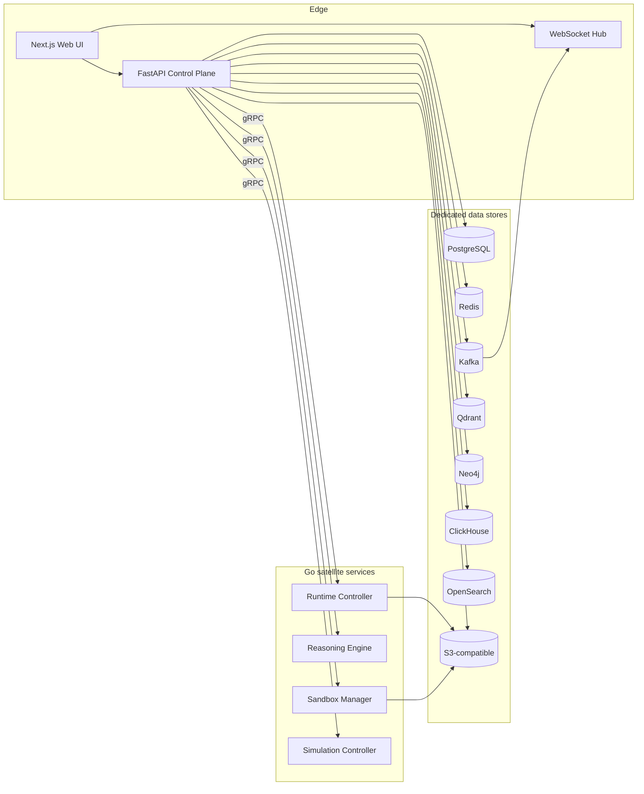

# musematic

**musematic** is a multi-tenant agent orchestration platform covering the full
lifecycle of AI agents: registration, certification, fleet coordination,
workflow execution, governance, and observability. It is designed as a
modular monolith (Python FastAPI control plane) surrounded by Go satellite
services for latency-critical work (reasoning, runtime, sandbox, simulation).

## Target audiences

This site is organised around three audiences; the navigation makes the split
explicit:

- **End users** — people who author agents and flows. Start with
  [Agents](agents.md) and [Flows](flows.md).
- **Platform administrators** — people who install, configure, enable
  features, and manage tenants, quotas, and credentials. Start with
  [Administration](administration/index.md).
- **Operators / SREs** — people who deploy, monitor, and troubleshoot the
  runtime. Start with [Installation](installation.md) and
  [Observability](administration/observability.md).

## Key capabilities

- **Agent registry with FQN addressing** — agents are identified by
  `namespace:local_name`, registered with a signed manifest, and versioned
  with immutable SHA-256 revisions. See [spec 021][s021].
- **Zero-trust visibility by default** — agents see no other agents or tools
  unless explicitly granted via FQN patterns. See [spec 053][s053].
- **Workflow engine with checkpoint & resume** — append-only execution
  journal, durable leases, approval gates, and compensation handlers. See
  [spec 029][s029].
- **Policy-enforced governance** — observer→judge→enforcer chains, behavioral
  contracts, and real-time safety pre-screener. See [spec 028][s028] and
  [spec 061][s061].
- **Goal-scoped multi-agent workspaces** — every workspace goal carries a
  GID that propagates through messages, executions, events, and analytics.
  See [spec 052][s052].
- **Interoperability** — A2A protocol for external agents and MCP for
  external tools; both flow through the platform's policy gateway. See
  [spec 065][s065] and [spec 066][s066].

## Architecture at a glance

Every store is chosen for its workload characteristic: PostgreSQL for ACID
truth, Qdrant for vectors, Neo4j for graphs, ClickHouse for analytics, Redis
for hot state, OpenSearch for full-text marketplace search, Kafka for events,
S3 for artifacts. See [`.specify/memory/constitution.md`][const] for the
enforcing principles.

## Quick links

- [Getting Started](getting-started.md) — prerequisites and first run.
- [Installation](installation.md) — deployment options and full env-var
  reference.
- [Agents](agents.md) — agent schema and three worked examples.
- [Flows](flows.md) — workflow schema and three worked examples.
- [Administration](administration/index.md) — platform admin surface.
- [Features](features/index.md) — one page per implemented feature.
- [FAQ](faq.md) — common questions and troubleshooting.
- [Roadmap](roadmap.md) — features planned but not yet implemented.

[s021]: https://github.com/gntik-ai/musematic/tree/main/specs/021-agent-registry-ingest
[s028]: https://github.com/gntik-ai/musematic/tree/main/specs/028-policy-governance-engine
[s029]: https://github.com/gntik-ai/musematic/tree/main/specs/029-workflow-execution-engine
[s052]: https://github.com/gntik-ai/musematic/tree/main/specs/052-gid-correlation-envelope
[s053]: https://github.com/gntik-ai/musematic/tree/main/specs/053-zero-trust-visibility
[s061]: https://github.com/gntik-ai/musematic/tree/main/specs/061-judge-enforcer-governance
[s065]: https://github.com/gntik-ai/musematic/tree/main/specs/065-a2a-protocol-gateway
[s066]: https://github.com/gntik-ai/musematic/tree/main/specs/066-mcp-integration
[const]: https://github.com/gntik-ai/musematic/blob/main/.specify/memory/constitution.md
